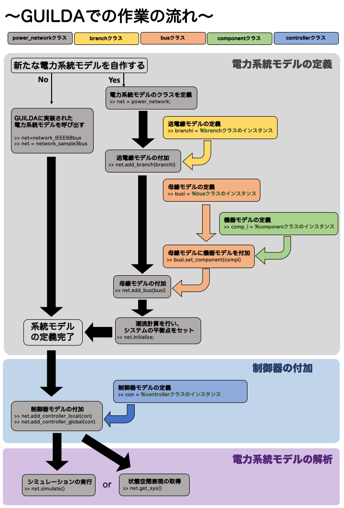
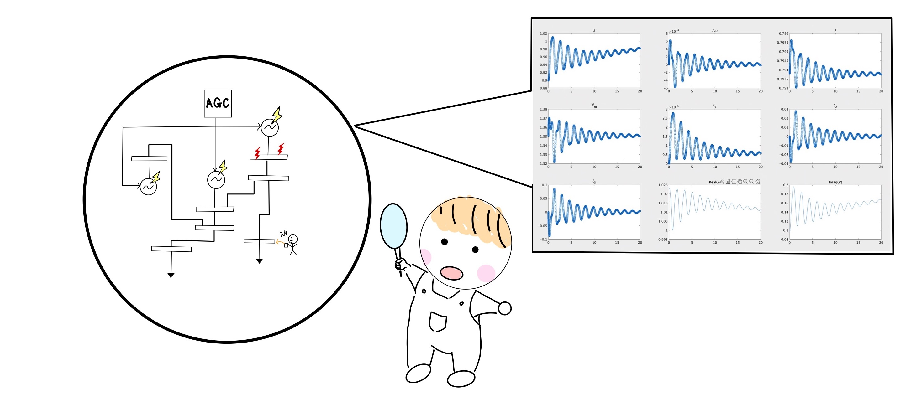

# <div style="text-align: center;"><span style="font-size: 130%; color: black; font-weight: bold">GUILDA in Detail</span></div>

In this page a detailed description of the three main functions of GUILDA is provided.

**Contents:**

- [Power System Model (Detailed).](#power_system_model_detailed)

- [Controllers.](#controllers)

- [Numerical Simulations.](#numerical_simulations)

  - [Simulating](#simulating)

  - [Derivation of a Linearized Model](#derivation_of_a_linearized_model)

These are depicted in the following image.

<div align="center"></div>

---

## <div style="text-align: center;"><span style="font-size: 130%; color: black; font-weight: bold">Power System Model (Detailed)</span></div>

This section provides a detailed explanation on the power system models that can be used in GUILDA.

In GUILDA, predefined power system models are already included (i.e., 3-bus and 68-bus models). However, it is possible to define and implement different models and run simulations on them.

To use the predifed power system models use the following codes.

```matlab
%Predefined Power System Models.
net = network_sample3bus; %Load the predefined 3-bus system model.
net = network_IEEE68bus; %Load the predefined 68-bus system model.
```

To define and implement a new power system model plese refer to the next explanation page (Click on the illustration ↓).

[<div align="center"></div>](./defineNet/0TopPage.md)

---

## <div style="text-align: center;"><span style="font-size: 130%; color: Black; font-weight: bold">Controllers</span></div>

This section explains the most relevant information of the controller class. For example, the controller types, how to define a new controller, how to implement it, its functional requirements, etc. (Click on the illustration ↓).

[<div align="center"></div>](./addController/0TopPage.md)

---

## <div style="text-align: center;"><span style="font-size: 130%; color:Black; font-weight: bold">Numerical Simulations</span></div>

This section explains how to perform numerical simulations with the selected power system model (predifined or newly defined, with or without controllers, etc.).

### <div style="text-align:"><span style="font-size: 120%; color: black; font-weight: bold">Simulating</span></div>

This section explains how to perform the simulations. It explains how to set the simulation conditions and how to read the results (Click on the illustration ↓).

[<div align="center"></div>](./Analysis/net_simulate.md)

### <div style="text-align:"><span style="font-size: 120%; color: black; font-weight: bold">Derivation of a Linearized Model</span></div>

This section describes the derivation of the approximate linearized model of the created power system model (Click on the illustration ↓).

[<div align="center"></div>](./Analysis/net_getsys.md)
