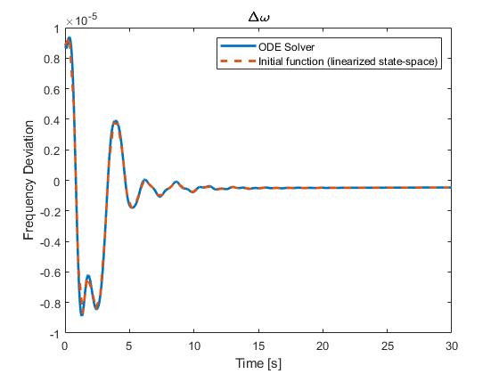
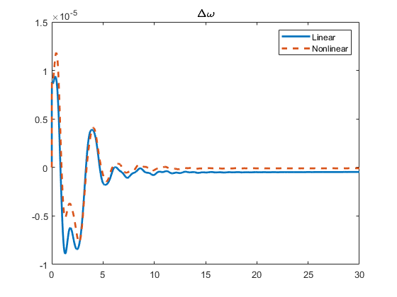

# <div style="text-align: center;"><span style="font-size: 140%; color: black; font-weight: bold">Derivation of a Linearized Model</span></div>

This section describes the derivation of the approximate linearized model of the created power system model.

**Contents:**

- [A Linearized Model.](#a_linearized_model)
- [Obtaining a Linearized Model.](#obtaining_a_linearized_model)
- [Examples.](#examples)
  - [Example 1 - Add a Controller.](#example_1_-_add_a_controller)
  - [Example 2 - View the System from a Specific Input to Output.](#example_2_-_view_the_system_from_a_specific_input_to_output)
  - [Example 3 - Linear Simulation Results.](#example_3_-_linear_simulation_results)
  - [Example 4 - Linear and Nonlinear Simulation Results.](#example_4_-_linear_and_nonlinear_simulation_results)

---

## <div style="text-align: center;"><span style="font-size: 120%; color: black; font-weight: bold">A Linearized Model</span></div>

This is a description of what a linearized model is. To provide an example the IEEE 68-bus power system model is linearized. For it, it is necessary to define the power system model, and then linearize it. Note that the linearization takes part when simulating the system.

```matlab
%Define the power network as the IEEE 68-bus model.
net = network_IEEE68bus();
```

Remember that the variable `net` includes all the information of the [power_network](../../SourceCode/power_network.md), which includes buses, branches, generators, controllers, etc.

The linearized system is simulated as follows

```matlab
%The system is linearized when it is simulated.
out = net.simulate([0 20], 'linear', true);
```

If the option `linear` is immediately followed by `true`, the system is linearized and simulated. if `false`, the system is not linearized and simulated.

For more information on the `option` arguments and the `simulate` method, please refer to [Simulating](../Analysis/net_simulate.md) under the "Simulation Execution Method" section.

---

## <div style="text-align: center;"><span style="font-size: 120%; color: black; font-weight: bold">Obtaining a Linearized Model</span></div>

### <div style="text-align: left;"><span style="font-size: 100%; color: black; font-weight: bold">Linearized Model Method (`get_sys`)</span></div>

To obtain the linearized version of the power system model, the method `get_sys` is used. It allows to transform the power system model into a state-space representation of the following form

$$
   \begin{matrix}
   \dot{x}=A(x-x^*)+B(u-u^*)\\
   y=C(x-x^*)+D(u-u*)\\
   \end{matrix}
$$

Method Structure: `sys =  net.get_sys(with_controller);`

_Note: The system obtained from `get_sys` takes as its state the deviation from the equilibrium point._

Input Arguments

- `with_controller`: Determines if a controller is added to the system (i.e., `true`) or not (i.e., `false`, default value). If a controller is added, it must be configured as well.

Output Parameters

- `sys`: The following variables are stored in this output.

   <div style="text-align: center;">
    </div>

  Some of these variables are automatically generated by the function [ss(A,B,C,D)](https://jp.mathworks.com/help/control/ref/ss.html) used in the `get_sys` script. Of these, only the six variables listed below have substantial information.

- `A,B,C,D`: Coefficient matrices of the state-space representation. They contain information on each element of the State Matrix `A`, the Input Matrix `B`, the Output Matrix `C`, and the Directivity Matrix `D` of the linearized system.
- `InputGroup`: It stores the name of each channel in the input vector $(u)$, and how many channels there are in the state-space representation.
- `OutputGroup`: It stores the name of each channel in the output vector $(y)$, and how many channels there are in the state-space representation.

_Note: The return value of `get_sys` is assumed to be `sys`, which is the case in the examples of this page, but of course a different name can be assigned._

### <div style="text-align: left;"><span style="font-size: 100%; color: black; font-weight: bold">Linearized Model Method in the 1-Axis Synchronous Generator Model</span></div>

This state-space representation can be applied to several components of the power system model. In this page the state-space representation is applied to a 1-Axis Synchronous Generator model as an example. Note that, of course, the meaning of the variables will change as the component analyzed changes.

Now, the variables of the state-space representation of a 1-Axis Synchronous Generator Model are explained.

**State $(x)$**

It is a vector that contains the information on the state of the generator.

There are 7 entries in the state of the generator.

Let $x_i$ be the state of the i-th generator, then the vector entries are

$$
  x_i =\left(
    %\begin{align}
    \begin{array}{ccccccc}
    \delta_i %&= Rotor angle
    \\
    \Delta\omega_i %&= Frequency deviation
    \\
    E_i %&= Internal voltage
    \\
    V_{\mathrm{fd}i} %&= AGC state variables
    \\
    \xi_{1i} %&= PSS state variable 1
    \\
    \xi_{2i} %&= PSS state variable 2
    \\
    \xi_{3i} %&= PSS state variable 3
    \\
    \end{array}
    %\end{align}
    \right)
$$

From top to bottom, these correspond to

- $\delta_i$: Rotor declination.
- $\Delta\omega_i$: Frequency deviation.
- $E_i$: Internal voltage of the generator.
- $V_{\mathrm{fd}}$: Controller (AGC) state variable.
- $\xi_{1i}$: Controller (PSS) state variable 1.
- $\xi_{2i}$: Controller (PSS) state variable 2.
- $\xi_{3i}$: Controller (PSS) state variable 3.

Since, in most power system models, there are several generators, then to generalize the state of all the generators we denote

- $I_{G}$: Total number of generators.
- $x_{i}$: The $\small i-th$ generator.
- $x$: The entire set of generators.

Then, $x$ is defined as:

$$
x = \left(
    \begin{array}{}
    x_1\\
    \vdots\\
    x_{I_G}\\
    \end{array}
\right)
$$

**Input Signal $(u)$**

It corresponds to the input signal that the component (i.e., generator or load) receives. Since the input signal depends on the target component, its details are explained for each component.

To define this variable we denote

- $I_{G}$: Total number of generators.
- $I_{L}$: Total number of loads.
- $I_{GL}$: Total number of components (generators and loads).
- $u_i$: Input signal of the $\small i-th$ component.
- $d_i$: Disturbance of the $\small i-th$ component.

_Note: $u_i$ and $d_i$ depend on the component type (i.e., generator or load)._

Then, the input $u$ is defined as:

$$
u=\left(
    \begin{array}{}
    u_1\\
    \vdots\\
    u_{I_{GL}}\\
    \\d_1\\
    \vdots\\
    d_{I_G}\\
    \end{array}
\right)
$$

_Input $\small (u_i)$ - Generator:_ There are 2 types of inputs, the Automatic Voltage Regulator (AVR) Input, and the Governor Input.

$$
 u_i=\left(
 \begin{array}{}
 u^{(i)}_{\mathrm{avr}}\\
 u^{(i)}_{\mathrm{governor}}\\
 \end{array}
 \right)
$$

- $u_{\mathrm{avr}}$: AVR Input (０ for generators with no AVR).
- $u_{\mathrm{governor}}$: Governor Input.

_Input $\small (u_i)$ - Load:_ There are 2 types of inputs, the percentage increase of the real part of the admittance, and the porcentual increase of the imaginary part of the admittance.

$$
   u_i=\left(
   \begin{array}{}
   u^{(i)}_1\\
   u^{(i)}_2\\
   \end{array}
   \right)
$$

- $u_1$: Porcentual Increase of the Real Part of the Admittance (i.e., Conductance $\small (G)$).
- $u_2$: Porcentual Increase of the Imaginary Part of the Admittance (i.e., Susceptance $\small (B)$).

The way in which the inputs $(u_1, u_2)$ modify the original admittance $\small (Y_{o})$ is described in the following expression.

$$
   Y = \mathrm{Re}[Y_{\mathrm{o}}](1+u_1) + j \text{ } \mathrm{Im}[Y_{\mathrm{o}}] (1+u_2)
$$

_Disturbance $\small (d)$ - Generator:_ Note that disturbances are treated as external inputs, as it is evidenced by the fact that they are elements of the input vector $u$. Also, consider that each generator $(i)$ can have multiple disturbances $(n)$, then the set of disturbances of the $\small i-th$ generator is given by

$$
  d_i=\left(
      \begin{array}{}
      d^{(i)}_{1}\\
      \vdots\\
      d^{(i)}_{n}\\
      \end{array}
      \right)
$$

_Disturbance $\small (d)$ - Load:_ In GUILDA, the disturbances in loads are ignored, since they are considered too small compared to those of the generators.

It is possible to add disturbances to the loads as well. However, since this changes the vector size, then it becomes necessary to redefine the processes that deal with this vector $(u)$.

**Output Signal $(y)$**

The output signal is composed from the following

- State of each generator $(x)$.
- Evaluation function of each generator $(z)$ (i.e., evaluation criterion when designing the control system).
- Voltage of each bus $(V)$.
- Current of each bus $(I)$.

  $$
  y=\left(
      \begin{array}{}
      x_1\\
      \vdots\\
      x_{I_G}\\
      \\z_1\\
      \vdots\\
      z_{I_G}\\
      \\V_1\\
      \vdots\\
      V_{I_{all}}\\
      \\I_1\\
      \vdots\\
      I_{I_{all}}\\
      \end{array}
  \right)
  $$

Note that each $V_i$ and $I_i$ are composed by a real part and imaginary part

$$
  V_i=\left(
      \begin{array}{}
      V_{\mathrm{real}}\\
      V_{\mathrm{image}}\\
      \end{array}
      \right)
      \quad,\quad
      I_i=\left(
          \begin{array}{}
          I_{\mathrm{real}}\\
          I_{\mathrm{image}}\\
          \end{array}
          \right)
$$

---

## <div style="text-align: center;"><span style="font-size: 120%; color: black; font-weight: bold">Examples</span></div>

### <div style="text-align: left;"><span style="font-size: 100%; color: black; font-weight: bold">Example 1 - Add a Controller</span></div>

**Objective:** Derive the state-space representation of the linearized model of a power network with controllers.

**Requirements:**

- The Power Network (i.e., `net`) must already be defined.

- The Controllers (e.g., `AGC`) must already be defined.

```matlab
%Derive the state-space representation of the linearized
%model of a power network with controllers.
sys =  net.get_sys(true);
```

Note that `get_sys(false)` means to derive the state-space representation of the system excluding the controller.

### <div style="text-align: left;"><span style="font-size: 100%; color: black; font-weight: bold">Example 2 - View the System from a Specific Input to Output.</span></div>

The system matrices (`A, B, C, D`) stored in the returned `sys` vary in size depending on the number of buses. In cases where the state-space representation contains matrices with a great ammount of elements, this function is useful, as it allows to extract only a portion of the system, viewed from a specific input to a specific output.

**Objective:** Extract a portion of the system, as it is viewed from the disturbance input $(d_1)$ to the evaluation output $(z_1)$.

**Requirements:**

- The Linearized System (`sys`) must already be defined.

```matlab
sys('z1','d1')
```

### <div style="text-align: left;"><span style="font-size: 100%; color: black; font-weight: bold">Example 3 - Linear Simulation Results.</span></div>

**Objective:** Compare the results of two methods in the following scenario: Simulate the time response of the synchronous generators to a ground fault in busbar 1 during time 0 - 0.01 s.

- Method 1: Using the MATLAB Solver ODE15S with approximate linearization (i.e., the method `simulate` and `option.linear = true`).

- Method 2: Using the linear state-space representation of the system (i.e., the method `get_sys`). The time response is obtained as a response to initial value conditions by the MATLAB function `initial()`.

**Requirements:**

- The code shown below.

```matlab
%Define the Power Network
net= network_IEEE68bus();

%Define the settings of the linear simulation during
%the ground fault segment t = [0, 0.01].
%This will be used as the initial conditions of the
%Linearized State-Space Representation.
option_fault = struct();
option_fault.fault = {{[0, 0.01], 1}};
option_fault.linear = true;
out_fault = net.simulate([0, 0.01], option_fault);

%ODE15S Solver

%Define the linear ODE15S solver and simulate.
option = struct();
option.x0_sys = horzcat(out_fault.X{:});
option.x0_sys = option.x0_sys(end,:)';
option.linear =true;
tmax = 30;
out_linear = net.simulate([0 tmax], option);

%Linearized State-Space Representation

%Obtain the linear state-space representation and simulate.
sys = net.get_sys();
x0 = horzcat(out_fault.X{:});
x0 = x0(end, :)' - net.x_equilibrium;
[z, t, x] = initial(sys, x0);

%Plot the results.
numele = size(find(t<tmax), 1);
z = z(1:numele, :);
t = t(1:numele, :);
x = x+net.x_equilibrium';
x = x(1:numele, :);
for i = 1:16
    figure
    p = plot(out_linear.t, out_linear.X{i}(:, 2), '-', t, x(:, 7*(i-1)+2), '--');
    p(1).LineWidth = 2;
    p(2).LineWidth = 2;
    title('\Delta\omega', 'Interpreter', 'tex');
    legend('ODE Solver','Initial function (linearized state-space)')
    xlabel('Time [s]')
    ylabel('Frequency Deviation')
end
```

Two examples of the result of this code are the following.

- The time response of the generator in busbar 7 (left).

- The time response of the generator in busbar 14 (right).

Note that the blue solid line represents the time response of the frequency deviation obtained by the ODE15S solver, while the orange dashed line corresponds to the one obtained by the initial value conditions applied to the linearized state-space representation. It is noteworthy that both responses are well aligned. Lastly, the buses 7 and 14 were chosen randomly and not for any reason in particular.




### <div style="text-align: left;"><span style="font-size: 100%; color: black; font-weight: bold">Example 4 - Linear and Nonlinear Simulation Results.</span></div>

**Objective:** Simulate the time response of the synchronous generators to a ground fault in busbar 1 during time 0 - 0.01 s, by using the MATLAB Solver ODE15S (i.e., `simulate`) with approximate linearization (i.e.,`option.linear = true`) and without approximate linearization (i.e., `option.linear = false`).

**Requirements:**

- The code shown below.

```matlab
%Define the Power Network
net = network_IEEE68bus();

%Define the settings for the nonlinear simulation.
option = struct();
option.fault = {{[0,0.01], 1}};
option.linear = false;
out_nonlinear = net.simulate([0, 30], option);

%Define the settings for the linear simulation.
option.linear = true;
out_linear = net.simulate([0, 30], option);

%Plot the results.
for i = 1:16
	figure
	p = plot(out_linear.t, out_linear.X{i}(:, 2), '-',out_nonlinear.t, out_nonlinear.X{i}(:, 2), '--');
    p(1).LineWidth = 2;
    p(2).LineWidth = 2;
    title('\Delta\omega', 'Interpreter', 'tex');
    legend('Linear','Nonlinear')
end
```

Two examples of the result of this code are the following.

- The time response of the generator in busbar 7 (left).

- The time response of the generator in busbar 14 (right).

Note that the blue solid line represents the time response of the frequency deviation obtained by the ODE15S solver of the linear system, while the orange dashed line corresponds to the one obtained for the nonlinear system.



