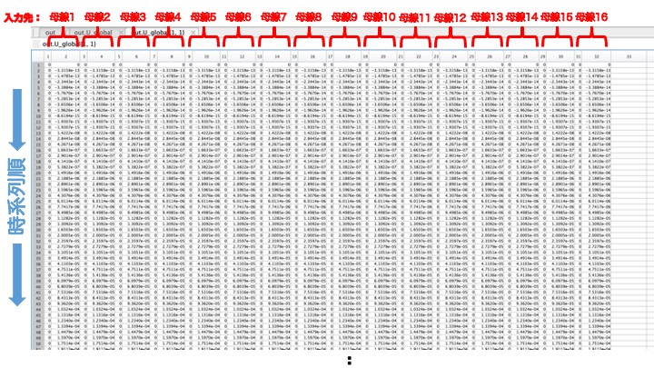

# <div style="text-align: center;"><span style="font-size: 140%; color: black; font-weight: bold">Simulating</span></div>

This section explains how to perform the simulations. It explains how to set the simulation conditions and how to read the results.

**Contents:**

- [Simulation Execution Method.](#simulation_execution_method)
    - [Time Argument.](#time_argument)
    - [Input Argument.](#input_argument)
    - [Time-Input Relationship.](#time_input_relationship)
    - [Option Argument.](#option_argument)
- [Results.](#results)
    - [Time Variable.](#time_variable)
    - [State Variable.](#state_variable)
    - [Voltage and Current Variable.](#voltage_and_current_variable)
    - [Global Controller State Response Variable.](#global_controller_state_response_variable)
    - [Global Controller Input Variable.](#global_controller_input_variable)
    - [Linear Controller State Response Variable.](#linear_controller_state_response_variable)
    - [Linear Controller Input Variable.](#linear_controller_input_variable)
    - [Busbar Variable.](#busbar_variable)
    - [Fault Busbar Variable.](#fault_busbar_variable)
    - [Admittance Matrix Variable.](#admittance_matrix_variable)
    - [Solver Variable.](#solver_variable)
- [Auxiliary Tools for Results.](#auxiliary_tools_for_results)
- [Simulation Examples](#simulation_-_examples)

---

## <div style="text-align: center;"><span style="font-size: 120%; color: black; font-weight: bold">**Simulation Execution Method**</span></div>

This section explains the function that simulates the power system model, which is defined as a method of the `power_network` class under the name `simulate`. The execution method is as follows

```matlab
%To set the options setting.
out = net.simulate(time,option);

%To set the inputs to the system.
out = net.simulate(time,u,u_idx);

%To set both the option setting, and the inputs to the system.
out = net.simulate(time,u,u_idx,option);
```

*Note: For the data structure of the output result `out`, please refer to the section [Results](#results) in the latter half of this page.*

From this point on, the arguments of the function `simulate` are explained.

### <div style="text-align: left;"><span style="font-size: 100%; color: black; font-weight: bold">**Time Argument**</span></div>

`time = [start, end]`

It specifies the time to run the simulation. 

For example, if you want to simulate 0-60 seconds, you can specify `time=[0,60]`.


### <div style="text-align: left;"><span style="font-size: 100%; color: black; font-weight: bold">**Input Argument**</span></div>

The Input Argument is composed by the arguments `u` and `u_idx`, where `u` is the input to the system, and `u_idx` is the device number to which the input is applied. By specifying the value of these arguments, a simulation can be performed with inputs to the system. Now `u_idx` is explained, while `u` is explained afterwards.

`u_idx = [device number] `

It specifies the device number to which the input is applied. The device number is the number of the busbar connected to the device. As an example here, we consider applying inputs to the devices numbered "1,16,20".

```matlab
u_idx = [1,16,20];
```

To set the input values, it is necessary to know the number of ports of the target device and the port number to which the input is given. As for the number of ports, it is obligatory to define a function `get_nu` in the component class to get the number of input ports, which can be found as follows.

```matlab
>> for idx = [1,16,20]
      nu = net.a_bus{idx}.component.get_nu;
      disp(['bus',num2str(idx,'%.2d'),':nu=',num2str(nu),'port'])
   end
```

The port number to which the input is applied must be determined by understanding the respective device model and considering the port number corresponding to the parameter to which you wish to add the input.

For example, in the IEEE 68-bus model, the component 1 and 16 are assigned the `generator_1axis` class, so the first input port is set to be an input to the field voltage command value and the second input port to the machine torque command value. On the other hand, the component 20 is of the `load_impedance` class, so the first input port is set to the command value of the multiplier of the real part of the impedance, and the second to the command value of the multiplier of the imaginary part.

### <div style="text-align: left;"><span style="font-size: 100%; color: black; font-weight: bold">**Time-Input Relationship**</span></div>

Now, the input to the system (`u`) is defined. The dimension of `u` is "the sum of the number of ports of the device to which the input is added "✕" (times) the number of time indices".

In the previous section  the argument `time` was defined as 1✕2 array of the simulation start and end times, but if an input signal is specified, then the argument `time` becomes the index of the time of the input signal. 

In the following image the time-input relationship is depicted by using a zero-order hold. 

```matlab
%Define the arguments time, u, and u_idx as shown above and assign them to the simulate function.
out = net.simulate(time,u,u_idx);
```


### <div style="text-align: left;"><span style="font-size: 100%; color: black; font-weight: bold">**Option Argument**</span></div>

In this section, the possible values of the option argument are explained. 

**Input Waveform (zero-order hold or first-order hold)** (`method`).

- Zero-Order Hold Input Signal:

```matlab
option.method = 'zoh';
```

- First-Order Hold Input Signal:

```matlab
option.method = 'foh';
```

- Code Example

```matlab
%Define time, u, and u_idx as shown above and assign them to the simulate function.
%Define the options as 'method' and 'zoh' (zero order hold).
out = net.simulate(time,u,u_idx,'method','zoh');
%Define the options as 'method' and 'foh' (first order hold).
out = net.simulate(time,u,u_idx,'method','foh');
```

The image below shows an example of a first order hold.


**Simulation Linearity** (`linear`).

- Nonlinear Model.

```matlab
option.linear = false;
```

- Approximate Linearized Model.

```matlab
option.linear = true;
```

**Ground Fault** (`fault`).

- No Ground Fault.

```matlab
option.fault = {};
```

- Ground Fault - Example 1.
 
A ground fault occurs on busbar 1 within 1-1.01 sec.

```matlab
option.fault = {{[1,1.01],1}};
```

- Ground Fault - Example 2.
 
In addition to the ground fault in Example 1, another ground fault occurs between 5-5.01 seconds on busbars 2 and 3.

```matlab
option.fault = {{[1,1.01],1},{[5,5.01],[2,3]}};
```

- Ground Fault - Example 3.
 
In addition to the Example 2, a ground fault occurs between 10-10.01 seconds on busbars 4-10.

```matlab
option.fault = {{[1,1.01],1},{[5,5.01],[2,3]},{[10,10.01],4:10}};
```

**Initial System State Condition** (`x0_sys`).

Initial value of the system state for the equilibrium point.

```matlab
option.x0_sys = net.x_equilibrium;
```

**Initial Busbar Voltage** (`V0`).

Initial value of each busbar voltage for power flow calculation.

```matlab
option.V0 = net.V_equilibrium;
```

- Example: Only the voltage magnitude of busbar 1 is set to be zero $\small (\lvert V \rvert = 0)$.

```matlab
option.V0 = net.V_equilibrium;
option.V0(1) = 0;
```

**Initial Busbar Current** (`I0`).

Initial value of each busbar current for power flow calculation.

```matlab
option.I0 = net.I_equilibrium;
```

- Example: The current phase of busbar 16 is shifted by $\small \pi/30$.

```matlab
option.I0 = net.I_equilibrium;
option.I0(16) = option.I0(16)*(cos(pi/30)+1j*sin(pi/30));
```

**Initial Local Controller State** (`x0_con_local`).

The initial value of the state of each local controller remains at the equilibrium point.

```matlab
option.x0_con_local = tools.vcellfun(@(c) c.get_x0(), obj.a_controller_local)
```

**Initial Global Controller State** (`x0_con_global`).

The initial value of the state of each global controller remains at the equilibrium point.

```matlab
option.x0_con_global = tools.vcellfun(@(c) c.get_x0(), obj.a_controller_local)
```

**Error thresholds for Numerical Integration** (`AbsTol`, `RelTol`).

Minimal required value: $10^{-8}$

```matlab
option.AbsTol = 1e-8;
option.RelTol = 1e-8;
```

*Note: Since GUILDA uses the Solver "ode15s" for numerical integration, please refer to the [ODE15S - official documentation](https://jp.mathworks.com/help/matlab/math/summary-of-ode-options.html) for tolerance adjustment.*

**Simulation Report Output Settings** (`do_report`).

- Generate Simulation Report.

```matlab
option.do_report = true;
```

- Don't Generate Simulation Report.

```matlab
option.do_report = false;
```

**Forced Termination Time** (`reset_time`).

- No Forced Termination Time (default value).

```matlab
option.reset_time = inf;
```

- Forced Termination Time - Example: If numerical analysis is not completed within 60 seconds, the analysis is terminated at that point.

```matlab
option.reset_time = 60;
option.do_retry = false;
```

**Retry Numerical Integration** (`do_retry`).

Once the forced termination time is reached, retry or not the numerical integration.

- Retry (default value).

```matlab
option.do_retry = true;
```

- Don't Retry - Example: Please refer to the `reset_time` condition setting example.

**Analysis Results Format** (`tools`).

- Output the Results with Format (default value).

```matlab
option.tools = false;
```

- Output the Results without Format.

```matlab
option.tools = true;
```

The default is to output the analysis results with format. If this option is set to `true`, the result will be outputted without format, and just as an instance of the class `simulationResult`.

*Note: If the simulation is planned to be executed several times, it is recommended to use the default value and output the results with format.*

**Define the Option Argument as a Structure**

The function `simulate` allows you to set detailed simulation conditions by assigning various parameters to the argument `option` in the form of a structure. The procedure for setting simulation conditions and its example code are as follows.

1. Define the variable `option` as a structure for setting conditions.
2. Select one of the arguments of `option` corresponding to the condition you want to set and assign a value to it.
3. Assign the defined `option`variable to the function `simulate`.

```matlab
%1. Define the variable option as a structure for setting conditions.
option = struct();

%2. Set initial values for system status.
option.x0_sys = net.x_equilibrium;
%If the frequency deviation (Δω) of the generator in busbar 1 is off by 0.01.
option.x0_sys(2) = option.x0_sys(2)+0.01;

%3.Simulation Execution.
time = [0,60];
out = net.simulate(time,option);
```

*Note: Refer to [Network Parameters](../../SourceCode/NetProperties.md) to see why `x0_sys(2)` corresponds to the frequency deviation of busbar 1.*


While the above explains how to define the variable `option` as a structure, the function `simulate` also allows to specify individual conditions directly as arguments. For example, suppose you write the following code

- Define the `option` Argument as a Structure.

```matlab
option = struct();

%Initial value of frequency deviation (Δω) of the generator of busbar 1 is deviated 
%from the equilibrium point by 0.01.
option.x0_sys = net.x_equilibrium;
option.x0_sys(2) = option.x0_sys(2)+0.01;

%Ground fault occurs on busbar 5 at 5-5.01s.
option.fault = {{[5,5.01],5}}; 

%Simulation time of 0-10 s.
out = net.simulate([0,10],option);
```

- Define the `option` Argument directly in the `simulate` Function.

Alternatively, the above simulation conditions can also be written as follows

```matlab
option = struct();

%Initial value of frequency deviation (Δω) of the generator of busbar 1 is deviated 
%from the equilibrium point by 0.01.
x0 = net.x_equilibrium;
x0(2) = x0(2)+0.01;

%Simulation time of 0-10 s with a ground fault that occurs on busbar 5 at 5-5.01s.
out = net.simulate([0,10],'x0_sys',x0,'fault',{{[5,5.01],5}});
```
*Note: When assigning the `option` argument directly in the `simulate` function, the arguments are included in the order `net.simulate(...'option', 'value',...)`.*


---

## <div style="text-align: center;"><span style="font-size: 120%; color: black; font-weight: bold">**Results**</span></div>

This section explains how to read the data in the output result (`out`).

In the following image an example is presented with the intention to explain its results (`out`).

**Simulation Example**

```matlab
%The IEEE 68-bus model is defined as the power network.
net = network_IEEE68bus;
%The time-input relationship is stablished
time = [0,5,20];
u_idx = [20,30];
u = ones(4,1)*[0,0.1,0.1]
%The fault on busbar 10 at 10-10.01 is set.
fault = {{[10,10.01],10}};
%An AGC global controller is added to all busbars.
con = controller_broadcast_PI_AGC(net,1:16,1:16,-10,-500);
net.add_controller_global(con);
%The simulation run is stablished.
out=net.simulate(time,u,u_idx,'fault',fault)
```


### <div style="text-align: left;"><span style="font-size: 100%; color: black; font-weight: bold">**Time Field (`t`)**</span></div>

This field represents the sampling time of the simulation. 

It contains an array of "number of samplings", which is used in all the other fields (`X,V,I,Xk_global,U_global,U`).

*Current Example: There are 1455 samplings*

### <div style="text-align: left;"><span style="font-size: 100%; color: black; font-weight: bold">**State Field (`X`)**</span></div>

This field contains the response data of the status of the devices connected to each bus bar.

`out.X` is a cell array in which each cell corresponds to one device at a time. 

The dimension of the numeric array is "number of samplings" ✕ "number of device states".


*Current Example: Since the IEEE 68-bus model is used, the busbars 1-16 have a synchronous generator (`generator_1axis`) with 7 states. Thus, the dimension of the numeric array is 1455 ✕ 7. From the busbar 17th only loads are attachd (`load_impedance`), which don't have states.*

<div align="center"></div>

It is possible to call the data of an specific state of a device, for example, the second state of the device connected to busbar 4.

```matlab
plot(out.t,out.X{4}(:,2))
```

### <div style="text-align: left;"><span style="font-size: 100%; color: black; font-weight: bold">**Voltage and Current Fields (`V, I`)**</span></div>

These fields contain the responses of the voltage and current of the busbars, respectively.

Just like the state field (`out.X`), the voltage and current fields also are a cell array of the same size as the number of busbars in the system model. 

Each cell contains a numeric array with "number of samplings" ✕ 2 (Real Part, Imaginary Part).

*Current Example: Each field (i.e., Voltage and Current), have 68 cells (busbars), and each cell has the time response (1455 samplings) of the real part and imaginary part.*

<div align="center"></div>

It is possible to call the data of an busbar, for example, to plot the magnitude of the voltage and current on busbar 10 during time 10-10.1s (a fault occurs during this time in this bus, thus the expected behaviour is $\small \lvert V \rvert \to 0; \lvert I \rvert \to \infty$).

```matlab
%Read the voltage of busbar 10.
V10 = out.V{10}(:,1) + 1j* out.V{10}(:,2);
%Read the current of busbar 10.
I10 = out.I{10}(:,1) + 1j* out.I{10}(:,2);
%Plot the absolute value of the voltage and current of busbar 10.
plot(out.t,abs(V10),out.t,abs(I10),'LineWidth',2)
legend({'$|V|$','$|I|$'},'Interpreter','latex')
xlabel('Time [s]')
ylabel('Magnitude [p.u.]')
```

<div align="center"></div>

### <div style="text-align: left;"><span style="font-size: 100%; color: black; font-weight: bold">**Global Controller State Response Field (`Xk_global`)**</span></div>

This field contains the global controller state response. 

*Current Example: In this case, the power system with one global controller added was used in the analysis. Thus `Xk_global` is a 1✕1 array of cells. The controller class `controller_broadcast_PI_AGC` has only one state, so the data stored in `out.Xk_global{1}` is a numeric array with "number of samples".*

### <div style="text-align: left;"><span style="font-size: 100%; color: black; font-weight: bold">**Global Controller Input Field (`U_global`)**</span></div>

This field contains the response of the input value from the global controller. Like `out.Xk_global`, this field is also a cell array with the same dimension as the number of controllers attached to the power system under analysis.

*Current Example: The controller added in this example is an AGC controller (reads the frequency deviation of the devices in busbars 1 through 16 and gives a command value to the Mechanical Power (`Pmech`) port of component (added to busbars 1 through 16) to balance the supply and demand of the entire system). In this case, the controller adds inputs to 16 Generators (`generator_1axis`) with 2 input ports each; thus, it has 2\*16 = 32 outputs. Therefore, the data in `out.U_gloobal{1}` shows "1455 ✕ 32 double".*

The correspondence between the input ports and the response data for each device is shown in the figure below, since the devices are specified in ascending order, `1:16`, as shown in the code below.

```matlab
con = controller_broadcast_PI_AGC(net,1:16,1:16,-10,-500);
```
Each cell is a 2-dimensional array of numbers. The row direction is the chronological order (samples). The column direction follows the input port order. 

*Current Example: Although the image is small, the first column is all 0 for each cell (i.e., each busbar with a generator). This is because the first input port of the Generators (`generator_1axis`) is the Field Voltage (`Vfield`) and the second port is the Mechanical Power (`Pmech`). The AGC controlle only gives command values to the Mechanical Power (`Pmech`).*


<div align="center"></div>

### <div style="text-align: left;"><span style="font-size: 100%; color: black; font-weight: bold">**Linear Controller State Response Field (`U`)**</span></div>

This field contains the local controller state response.

The data is read in the same way as in the global controller state response field (`U_global`).

*Current Example: No local controller is added, so the cell array is empty.*

### <div style="text-align: left;"><span style="font-size: 100%; color: black; font-weight: bold">**Linear Controller Input Field (`linear`)**</span></div>

This field is an index indicating whether the simulation was nonlinear or with an approximate linearization.

- Nonlinear: `out.linear = 0`.

- Approximate Linearization: `out.linear = 1`

---

### <div style="text-align: left;"><span style="font-size: 100%; color: black; font-weight: bold">**Internal Processes to Consinder**</span></div>

Before describing the data the four remaining fields, a brief description of the processing taking place inside the function `simulate` is pertinent. 

During the numerical analysis, there is usually a point where it becomes discontinuous. For example, when a discontinuous input is given, or when the conditions are discontinuous (e.g., ground fault: the voltage suddenly drops to zero). 


In these cases, the solver separates the analysis in two segments, divided by the discontinous point. This means that one solver is dedicated to the first segment of the problem (before the discontuinity), and a new solver is dedicated for the second segment (after the discontinuity). The solver for the second segment starts with the value to which the discontinuity element is applied.

*Current Example: The input signal of the current example is shown in the following figure. Furthermore, an ground fault occurs between 10 and 10.01 seconds. Thus, in total there are three discontinuous parts: 1. "The 5-second mark where the input value changes,". 2. "The 10-second mark where the ground fault occurs". 3."The 10.01-second mark where the ground fault ends". Therefore, the numerical analysis is divided into __four segments__: [0s to 5s], [5s to 10s], [10s to 10.01s], [10.01s to 20s].*

<div align="center"></div>

With this in mind, the explanation of the remaining fields can be retaken.

---

### <div style="text-align: left;"><span style="font-size: 100%; color: black; font-weight: bold">**Busbar Field**</span></div>

For each segment of the analysis: This field stores the index of the components being analyzed.

*Note: The busbars with `component_empty` connected are effectively treated as busbars to which no devices are connected (i.e., non-unit busbars).*

### <div style="text-align: left;"><span style="font-size: 100%; color: black; font-weight: bold">**Fault Busbar Field**</span></div>

For each segment of the analysis: This field stores the cell array classification of the index of the busbar where the ground fault occurs.

### <div style="text-align: left;"><span style="font-size: 100%; color: black; font-weight: bold">**Admittance Matrix Variable**</span></div>

For each segment of the analysis: This field stores in a cell array the generated Admittance Matrix for each segment.

### <div style="text-align: left;"><span style="font-size: 100%; color: black; font-weight: bold">**Solver Field**</span></div>

For each segment of the analysis: This field stores in a cell array the solvers running in each segment.

---

## <div style="text-align: center;"><span style="font-size: 120%; color: black; font-weight: bold">**Auxiliary Tools for Results (`tools`)**</span></div>

Finally, this section corresponds to the case when `option.tools = true;` is used to set simulation conditions. 

In addition to the fields described above, the following fields will be newly generated.

- `Vabs`: Voltage Magnitude $\small (\lvert V \rvert)$.
- `Vangle`: Voltage Phase Angle $\small (\angle V)$.
- `Iabs`: Current Magnitude $\small (\lvert I \rvert)$.
- `Iangle`: Current Phase Angle $\small (\angle I)$.
- `P`: Active Power $\small (P)$.
- `Q`: Reactive Power $\small (Q)$.

These fields can be obtained from the data in `out.V` and `out.I`, so they are redundant. Therefore, from the standpoint of capacity, these fields may be considered unnecessary. However, this `simulationResult` class is implemented to serve as an aid in understanding the contents of the output results.

When executed, the following display will appear. 
```matlab
Show "how to use?" (y/n):
%Type `y` and "enter" to display.
```

**Example - Command Input**

```matlab
>> out = net.simulate([0,10],'fault',{{[1,1.01],3}},'tools',true)
0|                                                            |10
 |=>=>=>=>=>=>=>=>=>=>=>=>=>=>=>=>=>=>=>=>=>=>=>=>=>=>=>=>=>=>|

==================================
  Auxiliary tools for outputting simulation results
      SimulationResult Class
==================================

Show usage?(y/n)：
```

Note that this class can be executed in two ways: 1. By command input (previous example), and 2. By UI Operation.

**Example - UI Operation**

```matlab
>> out.UIplot
```

---

# <span style="font-size: 70%; color: black;">** Simulation - Examples**</span>

The following page contains examples of handling the simulating functions explained in this page.

[Simulation - Examples](../Analysis/SampleCode.md){ .md-button .center}