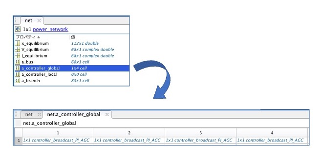

# <div style="text-align: center;"><span style="font-size: 140%; color: black; font-weight: bold">Controllers</span></div>

This section explains the most relevant information of the controller class. Since the purpose of GUILDA is "to provide a numerical simulation environment for students and researchers in the field of Systems and Control Engineering, it is assumed that the main users are those who aim to design controllers.

**Contents:**

- [Add a Controller to the Power Network.](#add_a_controller_to_the_power_network)
      - [Controller Types.](#controller_types)
      - [Implement the Controller.](#implement_the_controller)
      - [Example - Automatic Generation Control (AGC).](#example_-_automatic_generation_control_agc)
- [New Controller.](#new_controller)

---

## <div style="text-align: center;"><span style="font-size: 120%; color: black; font-weight: bold">Add a Controller to the Power Network</span></div>

### <div style="text-align: left;"><span style="font-size: 100%; color: black; font-weight: bold">Controller Types</span></div>

In GUILDA, the controllers are classified into two categories: local controllers and global controllers.

- **Local Controller:** A controller that is added locally to each device. Example: Retrofit controller.

- **Global Controller:** A controller for multiple devices. Example: Automatic Generation Control (AGC).

Both of these controllers are defined as objects of the controller class. The difference is that the local controller includes the input value of the global controller as an argument. This can be seen in the code, for example with the method "Controller State Derivative" (`get_dx_u`), which is defined in the controller class, but it is called differently, depending on the controller type, as follows.

- Controller State Derivative - Local Controller
  ```matlab
  [dx, u] = get_dx_u(obj, t, x, X, V, I, u_global)
  ```
- Controller State Derivative - Global Controller
  ```matlab
  [dx, u] = get_dx_u(obj, t, x, X, V, I, [])
  ```

### <div style="text-align: left;"><span style="font-size: 100%; color: black; font-weight: bold">Implement the Controller</span></div>

Suppose that a local controller is defined as an instance in a variable named `con`. 

*Note: The way to define the controller class depends on how each function is implemented, so please refer to the documentation of the controller class you intend to use.*

To add the defined local controller (`con`) to the power network (`net`) use the following

```matlab
net.add_controller_local(con);
```
Then a cell array is created in the `a_controller_local` property of the `power_network` class, and the controller class variables are listed in the order in which they were added.

For the case of a global controller. Suppose that a global controller is defined as an instance in a variable named `con`. To add the defined global controller (`con`) to the power network (`net`) use the following

```matlab
net.add_controller_global(con);
```

Similarly to the local controller case, a cell array is created in the `a_controller_global` property of the `power_network` class, and the controller class variables are listed in the order in which they were added.

<div style="text-align: center;">

</div>

To remove the controllers use the following

```matlab
%Remove the first controller in the cell array of a_controller_local
net.remove_controller_local(1);
```

```matlab
%Remove the third controller in the cell array of a_controller_global
net.remove_controller_global(3);
```


### <div style="text-align: left;"><span style="font-size: 100%; color: black; font-weight: bold">Example - Automatic Generation Control (AGC)</span></div>

This is an example on how to add the Automatic Generation Control (AGC) (`controller_broadcast_PI_AGC`) to a power network.

The AGC controller model observes the frequency deviation of generators $\small (\Delta \omega)$ and gives input to each generator to set the deviation to 0.

The usage of this controller class is

```matlab
%Define a AGC controller named "con"
con = controller_broadcast_PI_AGC_normal(net, y_idx, u_idx, Kp, Ki);
```
Input Arguments

- `net`: The created power network instance to which the controller is to be added.
- `y_idx`: The number of the busbar whose output is to be observed.
- `u_idx`: Number of the busbar to which the input is applied.
- `Kp`: Proportional gain of the controller.
- `Ki`: Integrative gain of the controller.

Now, let's implement this controller in the IEEE 68-bus power system model, where generators are added from busbar 1 to busbar 16. For this example, the controller is set to observe the frequency deviations of all 16 generators and provide input to all 16 generators.

The steps are: 

1. `net = network_IEEE68bus`  
   Add a controller to an instance of the `power_network` class that implements the IEEE 68-bus model.
2. `y_idx = 1:16`  
   Observe the frequency deviation of the synchronous generators connected from busbars 1 to 16.
3. `u_idx = 1:16`  
   Apply input to the synchronous generators connected from busbars 1 to 16.
4. `Kp = -10` `Ki = -500`  
   Define the Proportional (`Kp`) and Integrative (`Ki`) gains of the controller.

```matlab
%Define a power network instance named "net" of the IEEE 68-bus model class.
net = network_IEEE68bus;

%Define the AGC controller instance named "con" indicating that it will be applied to the "net" power network,
%will observe from bus 1 to 16, will apply input from bus 1 to 16, with P gain -10, and with I gain -500.
con = controller_broadcast_PI_AGC_normal(net, 1:16, 1:16, -10, -500);

%Add the defined controller instance to the power network.
net.add_controller_global(con);
```

This concludes the explanation to add a controller to the power system.

---

## <div style="text-align: center;"><span style="font-size: 120%; color: black; font-weight: bold">New Controller</span></div>

This section explains how to define a new controller model in GUILDA. The methods and properties that should be implemented are summarized in this section (Click on the illustration ↓).

If you want to use a controller model already implemented on GUILDA, you can skip this section.

[<div align="center"></div>](./NewController.md)