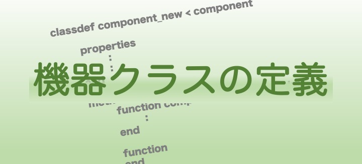

# <div style="text-align: center;"><span style="font-size: 140%; color: black; font-weight: bold">Power System Model (Detailed)</span></div>

This section provides a detailed explanation on how to define the power system models in GUILDA. As mentioned in the previous page, GUILDA can use the two predefined networks (i.e., 3-bus and 68-bus), as well as new defined ones. The objective of this section is to define a new network.

In GUILDA, the power system model is handled in the following manner:

- Stored in properties by using classes.
- Analyzed by modularized process as methods. 
    
The class that implements this power system model is defined in GUILDA with the class name `power_network`. In the following explanations, the variable that stores this `power_network` class will be refered to as `net` in the code explanations.

For further information on the details of the `power_network` class, please refer to the [Source Code Explanation](../../SourceCode/0TopPage.md) page.

**Contents:**

- [Predefined Power System Models.](#predefined_power_system_models)
- [New Power System Model.](#new_power_system_model)
- [New Components.](#new_components)

---

## <div style="text-align: center;"><span style="font-size: 130%; color: black; font-weight: bold">Predefined Power System Models</span></div>

To define the power system model to be used as one of the predefined in GUILDA use the following codes.

```matlab
%Predefined Power System Models.
net = network_sample3bus; %Load the predefined 3-bus system model.
net = network_IEEE68bus; %Load the predefined 68-bus system model.
```

The way it works is that these commands call a function file that contains a series of instructions to define an already defined power system model (i.e., 3-bus or 68-bus).

---

## <div style="text-align: center;"><span style="font-size: 130%; color: black; font-weight: bold">New Power System Model</span></div>

In this section it is explained how to create a new power system model and define it as the `power_network` class.

In GUILDA, a power system model is composed of

- Buses (Interconnection points)
- Branches (Transmission Lines)
- Components
    - Generators
    - Loads

Currently, GUILDA implements the classes `generator_1axis` for Generators and `load_impedance` for Loads. These classes are the ones used to define the new power system model in this explanation (Click on the illustration ↓).

[<div align="center"></div>](./NewPowerNetwork.md)

---


## <div style="text-align: center;"><span style="font-size: 130%; color: black; font-weight: bold">New Components</span></div>

In the previous section, a new power system model was defined using only the already implemented components in GUILDA (i.e., `generator_1axis` and `load_impedance`).

In this section it is explained how to implement a new equipment model with new dynamic characteristics (Click on the illustration ↓).

[<div align="center"></div>](./NewComponent.md)