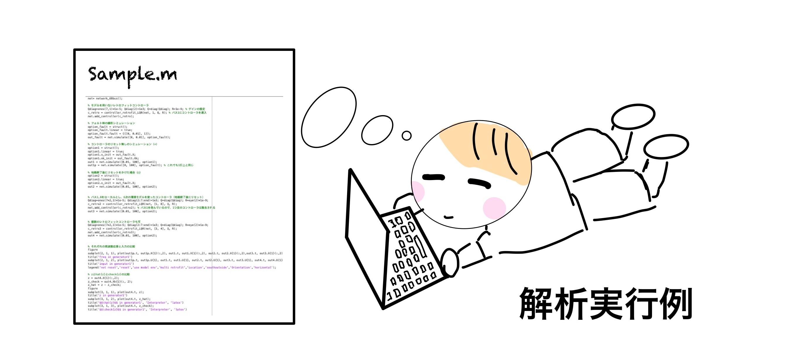
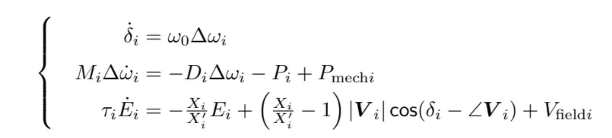
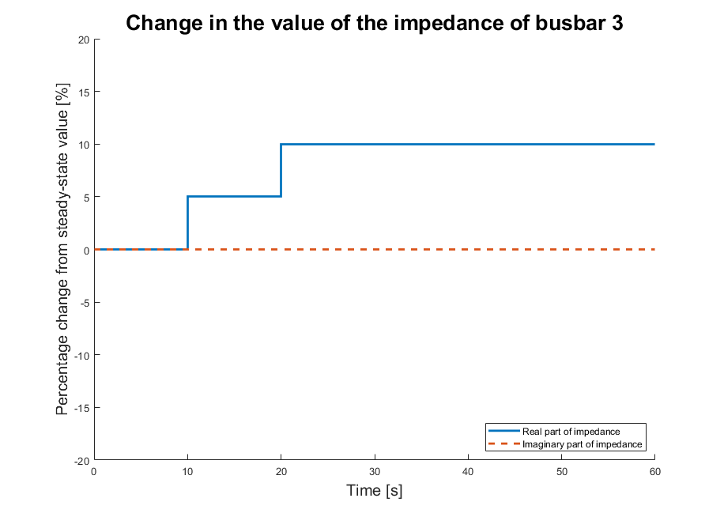
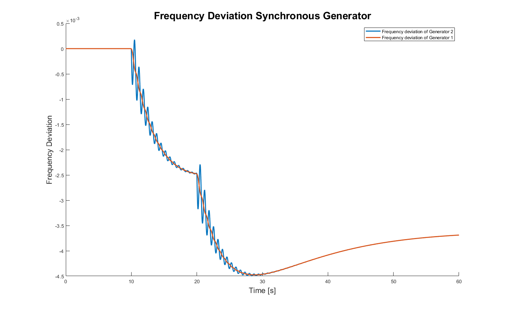
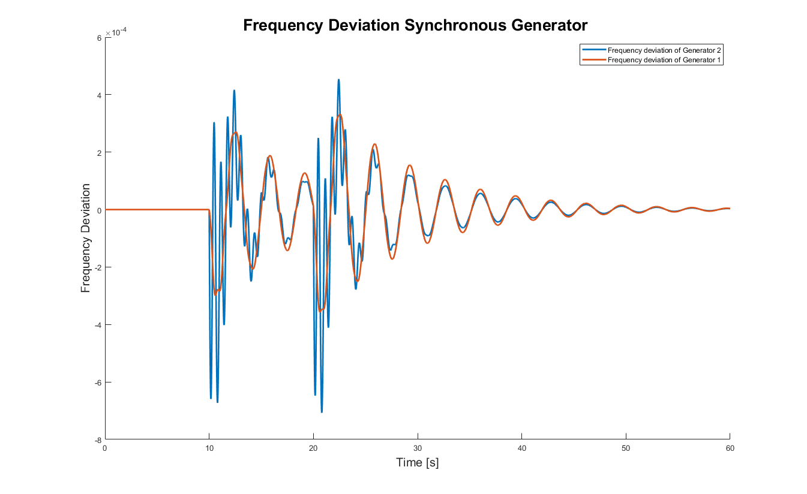
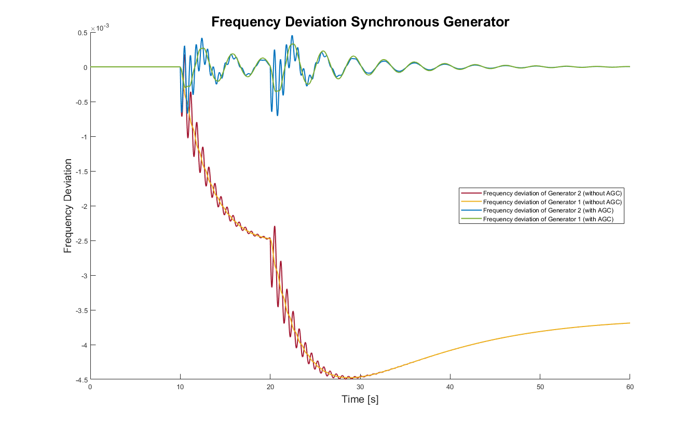

# <div style="text-align: center;"><span style="font-size: 130%; color: black; font-weight: bold">Guided Example</span></div>

This page provides a guided example in which the most important functionalities of GUILDA are shown: Define a Power System, Simulate the System's Response, Add a Controller, Simulate the System's Response with a Controller.

For this example, a 3-bus system is implemented from scratch in GUILDA, which is covered in the [reference text](https://www.coronasha.co.jp/np/isbn/9784339033847/). The process flow from network definition to its analysis is structured to be a single story, so you can deepen your understanding by reading through the pages in order and running the simulations on your own.

**Contents:**

- [Power System Model Construction.](#power_system_model_construction)
    - [Power Network Class.](#power_network_class)
    - [Branch Class.](#branch_class)
    - [Bus Class.](#bus_class)
    - [Component Class.](#component_class)

- [Derivation of Admittance Matrix.](#derivation_of_admittance_matrix)

- [Simulating.](#simulating)
    - [Simulation Conditions.](#simulation_conditions)
    - [Running the Simulation.](#running_the_simulation)
    - [Plotting Results.](#plotting_results)
    
- [Adding Controllers.](#adding_controllers)
    - [Definition of Controller Class.](#definition_of_controller_class)

- [Simulating with Controller.](#simulating_with_controller)
    - [Results Analysis.](#results_analysis)
    - [Comparison of Results.](#comparison_of_results)

- [Complete Sample Code.](#complete_sample_code)

---

## <div style="text-align: center;"><span style="font-size: 120%; color: black;">**Power System Model Construction**</span></div>

In this example a 3-bus system, as the one in the figure below is implemented.


---

### <span style="color: Black; ">**Power Network Class**</span>

The `power_network` class is the general framework of the power system model. This class defines `properties` and `methods`.

The `properties` organize and store information of each busbar, branch, components, etc.

The `methods` perform the simulation and other analysis using this data.

The definition of the `power_network` class is simple and can be executed as follows.

```matlab
net = power_network();
```

### <span style="color: Black; ">**Branch Class**</span>

To define the branch class is important to have the network's power line information organized. For it, consider that GUILDA implements two types of power lines: `branch_pi` and `branch_pi_transfer`.

- `branch_pi` class: Is a power line with a pi-type circuit model.

- `branch_pi_tranfer` class: Is a power line that includes a phase adjustment transformer. 

In this example, there are two transmission lines (branches): 

1. From "busbar 1" to "busbar 2".
2. From "busbar 2" to busbar 3". 

For this example, it is assumed that the transmission lines do not include phase adjusting transformers. The impedance and ground capacitance values on each transmission line are assumed to be

|Branch (busbar connection) | Branch Impedance|Branch Ground Capacitance|
| :-----------------------: | :-------------: | :---------------------: |
|Busbar 1 - Busbar 2| <span style="font-size: 100%; color: red;"> x12 = 0.010 + 0.085j</span> | <span style="font-size: 100%; color: red;">b12 = 0</span> |
|Busbar 2 - Busbar 3| <span style="font-size: 100%; color: red;"> x23 = 0.017 + 0.092j</span> | <span style="font-size: 100%; color: red;">b23 = 0</span> |

**Implementing in GUILDA**

To define the tranmission lines, use the `branch` class for each one with its information.

Class Structure：`branch_pi(from,to,[xreal,ximag],b);`

- `from` , `to`: Busbar number that the transmission line connects from and to, respectively.

- `xreal`, `x_imag`: Real and imaginary part of the transmission line's impedance.

- `b`: Transmission line's ground capacitance.

Lastly, assign the created branches to the power network by using the method `add_branch`.

The code for the example is

```matlab
%Definition of a transmission line connecting busbar 1 and busbar 2.
branch12 = branch_pi(1,2,[0.010,0.085],0);
%Adding the created transmission line (branch12) to the power network.
net.add_branch(branch12);
%Definition of a transmission line connecting busbar 2 and busbar 3.
branch23 = branch_pi(2,3,[0.017,0.092],0);
%Adding the created transmission line (branch23) to the power network.
net.add_branch(branch23);
```

For a more advanced tutorial on defining a power grid model please refer to the [Creating a Power System Model](../Reference/define/../defineNet/NewPowerNetwork.md) page.

### <span style="color: Black; ">**Bus Class**</span>

To define the bus class, the busbar type (i.e., PV, PQ, slack) and the value of the power flow in each busbar must be determined.

For this example, the following are set

|Busbar|Power Flow|Busbar Type|
|:----:|:--------:|:---------:|
|Busbar １|<span style="font-size: 100%; color: red;"> $\lvert V \rvert = 2.0,$ $\angle V ＝ 0.0$ </span>  | Slack Bus|
|Busbar ２|<span style="font-size: 100%; color: red;"> $P = 0.5,$ $\lvert V \rvert = 2.0$ </span>       |PV Bus|
|Busbar ３|<span style="font-size: 100%; color: red;"> $P = -3.0,$ $Q = 0.0$ </span>        |PQ Bus|

$\small P, Q, |V|,$ and $\small \angle V$ in the table refer to "active power", "reactive power", "bus bar voltage magnitude", and "voltage phase angle" respectively. For more information on busbar types and the meaning of each parameter in the power flow calculation, please refer to ["Power System Model (Simple)"](../aboutPowerSystem/0TopPage.md).

**Implementing in GUILDA**

The first step is to define the bus with its required variables (according to the bus type). Then the created busses are added to the `power_network` class via the `add_bus` method.

There are 3 types of busses: `bus_PV`, `bus_PQ`, and `bus_slack` classes, which are used separately for each bus bar type.

- Slack Bus: `bus_i = bus_slack(Vabs,Vangle,shunt);`
- PV Bus: `bus_i = bus_PV(P,Vabs,shunt);`
- PQ Bus: `bus_i = bus_PQ(P,Q,shunt);`

Note: The `shunt` argument is a 2 column vector wich refers to the real part (Conductance $\small G$) and imaginary part (susceptance $\small S$) of the admittance $\small{(Y)}$ of a shunt resistor connected to the ground (i.e., $\small{[G_{shunt}, B_{shunt}]}$). For more information on the arguments of each function, please refer to [Creating a Power System Model](../Reference/defineNet/NewPowerNetwork.md) page.

```matlab
%Definition of shunt admittance.
shunt = [0,0];
%Definition of busses 1 to 3.
bus_1 = bus_slack(2,0,shunt);
bus_2 = bus_PV(0.5,2,shunt);
bus_3 = bus_PQ(-3,0,shunt);
%Adding the created busses to the power network.
net.add_bus(bus_1);
net.add_bus(bus_2);
net.add_bus(bus_3);
```
Note that the `power_network` class manages the busses in the order in which they were defined by `add_bus`. When defining busbars, please assign them in the order of the busbar number.

### <span style="color: Black; ">**Component Class**</span>

To define the component class, the devices to be added to each busbar of the 3-bus model must be determined. 

In this example, busbar 1 (slack bus) and busbar 2 (PV bus) are generator busbars, while busbar 3 (PQ bus) is a load busbar. In this example, the generator busbars are connected to a single axis model of a synchronous generator, and the load busbars are connected to a constant-impedance model load.
 
The single axis model of the synchronous generator is shown in the equation below.
<br>



When adapting the synchronous generator model, each parameter in the above equation must be determined. 
The above information for this example is summarized in the following table.

|Busbar|Component|Synchronous reactance $(X_i)$ <br>(q-axis, d-axis)|Transient synchronous reactance $(X'_i)$ <br>(d-axis)|Time constant of the field current $(\tau_i)$ <br>(d-axis)|Inertia Coefficient $(M_i)$|Damping Factor $(D_i)$|
| :----: | :--------------------: | :-----------------------------------------------------: | :-----------------------------------------------: | :---------------------------------------: | :--------------------------------------: | :-------------------------------------: |
|Busbar １| Synchronous Generator (1 Axis Model) | <span style="color: red;">Xd = 1.569<br>Xq = 0.963</span> | <span style="color: red;">Xd_prime = 0.963 </span> | <span style="color: red;">T = 5.14 </span> | <span style="color: red;">M = 100 </span> | <span style="color: red;">D = 2 </span>  |
| Busbar２ | Synchronous Generator (1 Axis Model) | <span style="color: red;">Xd = 1.220<br>Xq = 0.667</span> |    <span style="color: red;">Xd_prime = 0.667 </span>    | <span style="color: red;">T = 8.97 </span> | <span style="color: red;">M = 12 </span>  | <span style="color: red;">D = 10 </span> |
|Busbar 3|Constant-load model| N/A | N/A | N/A | N/A | N/A |

Note: Due to restrictions on variable names that can be implemented in MATLAB the following are rewritten as follows

- $X'_i →$ Xd_prime
- $\tau_i →$ T

**Implementing in GUILDA**

In contrast to the definition of the `branch` and `bus` classes, which are added to the `power_network` one, the `component` class is added to the `bus` class. This is because the components are connected to each busbar separately.

The single axis model of a synchronous generator is defined in the class `generator_1axis`. 

The constant impedance model is defined in the class `load_impedance`. 

The component implementation code is as follows

```matlab
%Definition of the power system's frequency.
omega0 = 60*2*pi;

%Adds the 1-axis model of a synchronous generator to busbar 1.
Xd = 1.569; Xd_prime = 0.963; Xq = 0.963; T = 5.14; M = 100; D = 10;
mac_data = table(Xd,Xd_prime,Xq,T,M,D);
component1 = generator_1axis(omega0, mac_data);
net.a_bus{1}.set_component(component1);

%Adds the 1-axis model of a synchronous generator to busbar 2.
Xd = 1.220; Xd_prime = 0.667; Xq = 0.667; T = 8.97; M = 12; D = 10;
mac_data = table(Xd,Xd_prime,Xq,T,M,D);
component2 = generator_1axis(omega0, mac_data);
net.a_bus{2}.set_component(component2);

%Adds the constant impedance load model to busbar 3.
component3 = load_impedance();
net.a_bus{3}.set_component(component3);
```
Note on `mac_data`: Since the `generator_1axis()` method takes `mac_data` as an argument, it means that it reads the variable names for each parameter from it; thus, the defined variables names should be consistent.

All of the power system model compenents have now been added. To finilize the power system model denifinition use

```matlab
net.initialize;
```

This method called `initialize` is defined in the `power_network` class. It calculates the power flow, the equilibrium point of the entire system, and stores each value. These values can be viewed from the workspace. For more information on these parameters, please refer to the [Network Parameters](../SourceCode/NetProperties.md) page. 

---

## <div style="text-align: center;"><span style="font-size: 120%; color: black; font-weight: bold">Derivation of Admittance Matrix</span></div>

In the [reference text](https://www.coronasha.co.jp/np/isbn/9784339033847/), the admittance matrix was obtained based on the branch parameters. This can be done by the simulator by running the following code

```matlab
>> net.get_admittance_matrix
ans =
   (1,1)      1.3652 -11.6041i
   (2,1)     -1.3652 +11.6041i
   (1,2)     -1.3652 +11.6041i
   (2,2)      3.3074 -22.1148i
   (3,2)     -1.9422 +10.5107i
   (2,3)     -1.9422 +10.5107i
   (3,3)      1.9422 -10.5107i
```

This should be the output for this example. 

Admittance matrices are generally sparse matrices, and are outputted as a table in the form of (entry index, value). If you want to display it as a matrix, run the following code

```matlab
>> full(net.get_admittance_matrix)
ans =
   1.3652 -11.6041i  -1.3652 +11.6041i   0.0000 + 0.0000i
  -1.3652 +11.6041i   3.3074 -22.1148i  -1.9422 +10.5107i
   0.0000 + 0.0000i  -1.9422 +10.5107i   1.9422 -10.5107i
```

Incidentally, this function `get_admittance_matrix` is also used inside the calculation of the function `initialize` described earlier, as you can see from the fact that the admittance matrix is needed for the power flow calculation.

---

## <div style="text-align: center;"><span style="font-size: 120%; color: black; font-weight: bold">Simulating</span></div>

### <span style="color: Black; font-weight:bold">Simulation Conditions</span>

For this example the load in busbar 3 will be increased in two steps:

1. 5% increase in the real part of the impedance value.
2. 10% increase in the real part of the impedance value.

The objective is to observe the "frequency deviation of the synchronous generators" in busbars 1 and 2. The following is a summary of the simulation setup conditions.

|Total Analysis Time|Time of Condition Change|Condition Change|
|:------:|:----------------------:|:-------------------------------------------------------------------------------------------------------------------:|
|<br>0-60 seconds|10 seconds<br><br>20 seconds|5% increase in the real part of the impedance value.<br><br>10% increase in the real part of the impedance value.|

The following shows the simulation conditions graphically.




### <span style="color: Black; font-weight: bold">Running the Simulation</span>

In this page only the execution code is presented. For a more detailed explanation on the variables and how to set the simulating conditions, please refer to the dedicated page [Simulating](../Reference/Analysis/net_simulate.md).

```matlab
%Define the important time steps.
time = [0,10,20,60];
%Define the affected busbar.
u_idx = 3;
%Define the input value for each busbar.
u     = [0, 0.05, 0.1, 0.1;...
         0,    0,   0,   0];
%Store the simulation results.
out1 = net.simulate(time,u, u_idx);
```

### <span style="color: Black; font-weight: bold ">Plotting Results</span>

Running the above code will perform the simulation, the progress will be displayed in the command window. When the simulation is finished, take a look at the output results.

For this example, the objective is to observe the frequency deviation between busbars 1 and 2, thus the focus is on the variable `X` (generator state) of the output (`out1`). 

In the case of the 1-axis generator model, the entries of the state `x` are:

- Rotor declination $(\delta)$.
- Frequency deviation $(\Delta \omega)$.
- Internal voltage $(E)$.

Thus, for this example, only the second entry of the state is needed. For more information on how to read the data in the output results, please refer to [Simulating](../Reference/Analysis/net_simulate.md).

```matlab
%Data extraction.
sampling_time = out1.t;
omega1 = out1.X{1}(:,2);
omega2 = out1.X{2}(:,2);

%Plot the results.
figure;
hold on;
plot(sampling_time, omega2,'LineWidth',2)
plot(sampling_time, omega1,'LineWidth',2)
xlabel('Time [s]','FontSize',15);
ylabel('Frequency Deviation','FontSize',15);
legend({'Frequency deviation of Generator 2','Frequency deviation of Generator 1'})
title('Frequency Deviation Synchronous Generator','FontSize',20)
hold off
```

<div align="center">

</div>

The results show that the frequency deviation changes significantly at the 10-second and 20-second mark, which is when the impedance value of the load is increased. This is because the supply-demand balance is no longer achieved, due to the increase in load power consumption.

Continuous power supply with a non-zero frequency deviation is not good for power quality, and is a major problem for factories and other facilities that handle precision equipment. Therefore, in actual power system operation, a controller is incorporated to restore the frequency deviation to zero. In the next section, a standard controller called Automatic Generation Control (AGC) is incorporated into the power system model.

**Code Sumary until now**
```matlab
%Define a new Power Network
net = power_network();

%Definition of a transmission line connecting busbar 1 and busbar 2.
branch12 = branch_pi(1,2,[0.010,0.085],0);
%Adding the created transmission line (branch12) to the power network.
net.add_branch(branch12);
%Definition of a transmission line connecting busbar 2 and busbar 3.
branch23 = branch_pi(2,3,[0.017,0.092],0);
%Adding the created transmission line (branch23) to the power network.
net.add_branch(branch23);

%Definition of shunt admittance.
shunt = [0,0];
%Definition of busses 1 to 3.
bus_1 = bus_slack(2,0,shunt);
bus_2 = bus_PV(0.5,2,shunt);
bus_3 = bus_PQ(-3,0,shunt);
%Adding the created busses to the power network.
net.add_bus(bus_1);
net.add_bus(bus_2);
net.add_bus(bus_3);

%Definition of the power system's frequency.
omega0 = 60*2*pi;
%Adds the 1-axis model of a synchronous generator to busbar 1.
Xd = 1.569; Xd_prime = 0.963; Xq = 0.963; T = 5.14; M = 100; D = 10;
mac_data = table(Xd,Xd_prime,Xq,T,M,D);
component1 = generator_1axis(omega0, mac_data);
net.a_bus{1}.set_component(component1)
%Adds the 1-axis model of a synchronous generator to busbar 2.
Xd = 1.220; Xd_prime = 0.667; Xq = 0.667; T = 8.97; M = 12; D = 10;
mac_data = table(Xd,Xd_prime,Xq,T,M,D);
component2 = generator_1axis(omega0, mac_data);
net.a_bus{2}.set_component(component2);
%Adds the constant impedance load model to busbar 3.
component3 = load_impedance();
net.a_bus{3}.set_component(component3);

%Initilize the Power Network
net.initialize;

%Define the important time steps.
time = [0,10,20,60];
%Define the affected busbar.
u_idx = 3;
%Define the input value for each busbar.
u     = [0, 0.05, 0.1, 0.1;...
         0,    0,   0,   0];
%Store the simulation results.
out1 = net.simulate(time,u, u_idx);

%Data extraction.
sampling_time = out1.t;
omega1 = out1.X{1}(:,2);
omega2 = out1.X{2}(:,2);

%Plot the results.
figure;
hold on;
plot(sampling_time, omega2,'LineWidth',2)
plot(sampling_time, omega1,'LineWidth',2)
xlabel('Time [s]','FontSize',15);
ylabel('Frequency Deviation','FontSize',15);
legend({'Frequency deviation of Generator 2','Frequency deviation of Generator 1'})
title('Frequency Deviation Synchronous Generator','FontSize',20)
hold off
```

---

## <div style="text-align: center;"><span style="font-size: 120%; color: black; font-weight: bold">Adding Controllers</span></div>

For this example, the standard controller AGC is added to the power system model. It is a Proportional-Ingetral (PI) controller that observes the frequency deviation values from the all or some of the synchronous generators in the network, and transmits the required mechanical input $(P_{mech})$ value to each generator to balance the supply and demand of the entire system.

### <span style="color: Black; font-weight: bold ">Definition of controller class</span>

GUILDA defines AGC with the class name `controller_broadcast_PI_AGC`.

Class Structure: `controller_broadcast_PI_AGC(net,y_idx,u_idx,Kp,Ki);` 

- `net`: Power system network to which the controller is added.
- `y_idx`: Index of the generator to observe. 
- `u_idx`: Index of the generators to control. 
- `Kp, Ki`: P and I controller gains, respectively.

For a more detailed explanation, please refer to the dedicated page [Simulating](../Reference/Analysis/net_simulate.md).

In this example, the synchronous generators connected to busbars 1 and 2  are the observation, as well as the input targets. Therefore, `y_idx=1:2` and `u_idx=1:2`. For it use the following code

```matlab
%Define AGC controller
con = controller_broadcast_PI_AGC(net,1:2,1:2,-10,-500);

%Assign controller class to power system
net.add_controller_global(con);
```

---

## <div style="text-align: center;"><span style="font-size: 120%; color: black; font-weight: bold">Simulating with Controller</span></div>

### <span style="color: Black; font-weight: bold ">Results Analysis</span>

Now, let's run the same simulation as before using the system model with the controller added.

```matlab
%Analysis Execution
out2 = net.simulate(time,u, u_idx);

%data extraction
sampling_time = out2.t;
omega1 = out2.X{1}(:,2);
omega2 = out2.X{2}(:,2);

%Plot
figure;
hold on;
plot(sampling_time, omega2,'LineWidth',2)
plot(sampling_time, omega1,'LineWidth',2)
xlabel('Time [s]','FontSize',15);
ylabel('Frequency Deviation','FontSize',15);
legend({'Frequency deviation of Generator 2','Frequency deviation of Generator 1'})
title('Frequency Deviation Synchronous Generator ','FontSize',20)
hold off

```

<div align="center">

</div>

The results show that the frequency deviations of each generator converge to 0 after the controller is added. Although, there are still oscillations at the time marks when the load was increased (10 second and 20 second mark).

### <span style="color: Black; font-weight: bold ">Comparison of Results</span>

This is the comparison of responses of the system with and without the controller.

The figure below plots the two results above on the same scale. It can be clearly seen that for the same load variation, the frequency deviation is significantly more without the AGC controller. In other words, the AGC controller is able to balance the supply and demand of the entire system and suppress the frequency deviation.

<div align="center">

</div>

This concludes this example.

As a final note, we emphasize that the simulator has been designed to be scalable so that it can be used to implement various power system models. This is just one example, but if you would like to know more about the different usage of each class, please refer to pages such as [GUILDA in Detail](../Reference/0TopPage.md), for more detailed information on each class and its usage.

---

## <div style="text-align: center;"><span style="font-size: 120%; color: black; font-weight: bold">Complete Sample Code</span></div>

```matlab
%Create a framework for the power system
net = power_network;

%Branch Definition

    %Definition of a transmission line connecting busbar 1 and busbar 2
    branch12 = branch_pi(1,2,[0.010,0.085],0);
    net.add_branch(branch12);
    %Definition of a transmission line connecting busbar 2 and busbar 3
    branch23 = branch_pi(2,3,[0.017,0.092],0);
    net.add_branch(branch23);


%Definition of busbar (bus)
    shunt = [0,0];
    %Definition of busbar 1
    bus_1 = bus_slack(2,0,shunt);
    net.add_bus(bus_1);
    %Definition of busbar 2
    bus_2 = bus_PV(0.5,2,shunt);
    net.add_bus(bus_2);
    %Definition of busbar 3
    bus_3 = bus_PQ(-3,0,shunt);
    net.add_bus(bus_3);


%Definition of component

    %Definition of grid frequency
    omega0 = 60*2*pi;

    %1-axis model of synchronous generator added to bus-bar 1
    Xd = 1.569; Xd_prime = 0.963; Xq = 0.963; T = 5.14; M = 100; D = 10;
    mac_data = table(Xd,Xd_prime,Xq,T,M,D);
    component1 = generator_1axis( omega0, mac_data);
    net.a_bus{1}.set_component(component1);

    %A single axis model of a synchronous generator is also added to busbar 2.
    Xd = 1.220; Xd_prime = 0.667; Xq = 0.667; T = 8.97; M = 12; D = 10;
    mac_data = table(Xd,Xd_prime,Xq,T,M,D);
    comp2 = generator_1axis( omega0, mac_data);
    net.a_bus{2}.set_component(comp2);

    %A constant impedance model is added to bus-bar 3
    comp3 = load_impedance();
    net.a_bus{3}.set_component(comp3);


%Running tidal current calculations
net.initialize


%Aside ~Derivation of admittance matrix~.
full(net.get_admittance_matrix)


%Simulation run (without controller)

    %Condition Setting
    time = [0,10,20,60];
    u_idx = 3;
    u = [0, 0.05, 0.1, 0.1;...
         0,    0,   0,   0];

    %Input signal waveform plot
    figure; hold on;
    u_percent = u*100;
    stairs(time,u_percent(1,:),'LineWidth',2)
    stairs(time,u_percent(2,:),'--','LineWidth',2)
    xlabel('Time (s)','FontSize',15);
    ylabel('Percentage change from steady-state value(%)','FontSize',15);
    ylim([-20,20])
    legend({'Real part of impedance','Imaginary part of impedance'},'Location','southeast')
    title('Change in the value of the impedance of bus-bar 3','FontSize',20)
    hold off;

    %Analysis Execution
    out1 = net.simulate(time,u, u_idx);

    %data extraction
    sampling_time = out1.t;
    omega1 = out1.X{1}(:,2);
    omega2 = out1.X{2}(:,2);

    %plot
    figure; hold on;
    plot(sampling_time, omega2,'LineWidth',2)
    plot(sampling_time, omega1,'LineWidth',2)
    xlabel('Time (s)','FontSize',15);
    ylabel('Frequency Deviation','FontSize',15);
    legend({'Frequency deviation of Generator 2','Frequency deviation of Generator 1'})
    title('Frequency Deviation Synchronous Generator','FontSize',20)
    hold off

%Adding a controller to the power system

    %Define AGC controller
    con = controller_broadcast_PI_AGC(net,1:2,1:2,-10,-500);

    %Assign controller class to power system
    net.add_controller_global(con);


%Simulation run (with controller)

    %Analysis Execution
    out2 = net.simulate(time,u,u_idx);

    %data extraction
    sampling_time = out2.t;
    omega1 = out2.X{1}(:,2);
    omega2 = out2.X{2}(:,2);

    %Plot
    figure; hold on;
    plot(sampling_time, omega2,'LineWidth',2)
    plot(sampling_time, omega1,'LineWidth',2)
    xlabel('Time (s)','FontSize',15);
    ylabel('Frequency Deviation','FontSize',15);
    legend({'Frequency deviation of Generator 2','Frequency deviation of Generator 1'})
    title('Frequency Deviation Synchronous Generator','FontSize',20)
    hold off

%Comparison plots before and after adding the controller
    figure; hold on;
    plot(out1.t, out1.X{2}(:,2),'Color','#A2142F','LineWidth',1.5)
    plot(out1.t, out1.X{1}(:,2),'Color','#EDB120','LineWidth',1.5)
    plot(out2.t, out2.X{2}(:,2),'Color','#0072BD','LineWidth',1.5)
    plot(out2.t, out2.X{1}(:,2),'Color','#77AC30','LineWidth',1.5)
    xlabel('Time [s]','FontSize',15);
    ylabel('Frequency Deviation','FontSize',15);
    legend({'Frequency deviation of Generator 2 (without AGC)','Frequency deviation of Generator 1 (without AGC)',...
                'Frequency deviation of Generator 2 (with AGC)','Frequency deviation of Generator 1 (with AGC)'},...
                'Location','east')
    title('Frequency Deviation Synchronous Generator','FontSize',20)
    hold off
```
