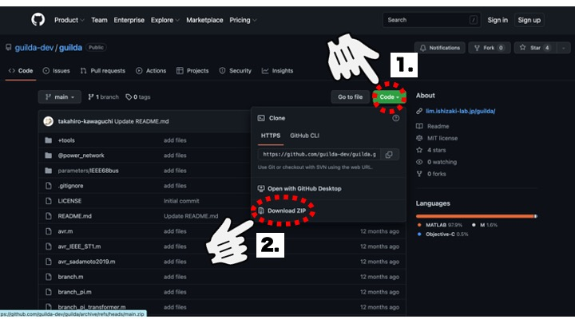
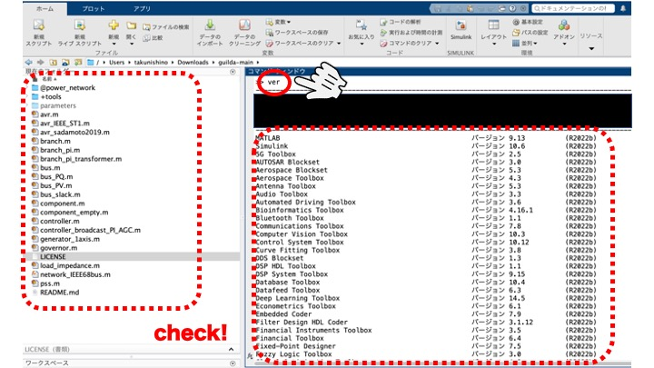
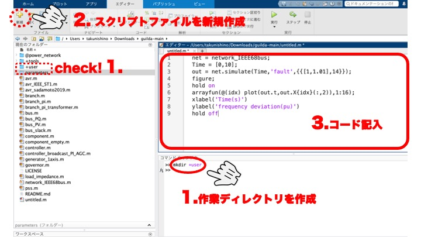
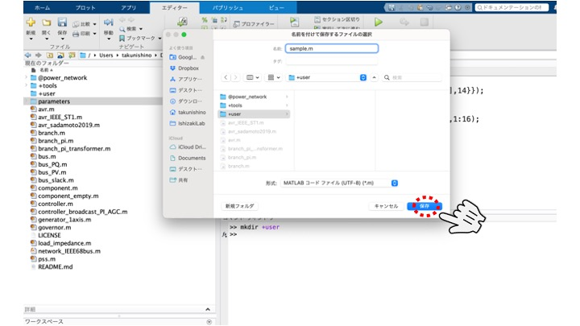
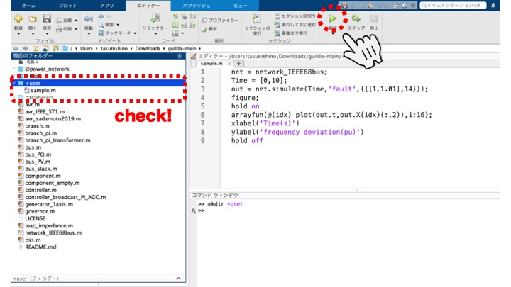
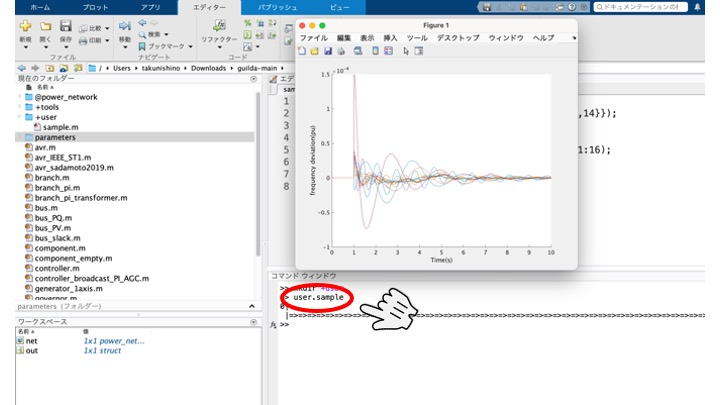

# <div style="text-align: center;"><span style="font-size: 140%; color: black; font-weight: bold">GUILDA Setup</span></div>

This section explains how to download the public source code and set up the environment.

**Contents:**

- [Requirements](#requirements)
- [Download](#download_guilda_source_code)
- [Operation in MATLAB](#operation_in_matlab)
- [Workflow](#workflow)

---

## <div style="text-align: center;"><span style="font-size: 120%; color: black; font-weight: bold">Requirements</span></div>

MATLAB Toolboxes necessary to run this simulator:

- Optimizaiton Toolbox.
- Control System Toolbox.
- Robus Control Toolbox.

---

## <div style="text-align: center;"><span style="font-size: 120%; color: black; font-weight: bold">Download GUILDA Source Code</span></div>

The source code is available to the public on Git. Please use the link from the [GUILDA introduction site](https://lim.ishizaki-lab.jp/guilda) on the Ishizaki Laboratory's website. You can clone and manage the download from the Git repository. The following images show the procedure to save the files to your local computer as a zip file.

<div style="text-align: center;">

</div>

<div style="text-align: center;">

</div>

---

## <div style="text-align: center;"><span style="font-size: 130%; color: black; font-weight: bold">Operation in MATLAB</span></div>

<div style="text-align: center;">

</div>

<br>

To open GUILDA in MATLAB:

1. Extract the source code zip file you have just downloaded, open MATLAB and navigate to the directory.

2. Make sure that the "current folder" window of MATLAB is showing the correct directory. It can be checked by localizing the first folder `@power_network`, as shown in the image below.

3. Check if the required toolboxes for GUILDA are installed. To do it write `ver` in the command window of MATLAB and check if the required toolboxes are installed, these are: Optimization Toolbox, Control System Toolbox, Robust Control Toolbox.

<div style="text-align: center;">

</div>

---

## <div style="text-align: center;"><span style="font-size: 120%; color: black; font-weight: bold">Workflow</span></div>

In MATLAB it's possible to work one line at the time (via the command window), or several lines at the time (in a script), when performing analysis the latter is recommended.

Recommended workflow:

**1. Create a working directory:** It is recommended that a separated working directory is created, as it will avoid mixing the new created code with the source code. In this example, a new directory named `+user` is created. The name of the directory can be anything, but _make sure to put `+` at the beginning_. This allows the m-files of the source code to be passed through, while also allowing the m-files in the `+user` folder to be executed.

```matlab
%Execution command
mkdir +user
```

**2. Create a new script file:** Create a new script file by clicking on "New Script" in the upper left corner of the window, which will launch a new file in the editor.

**3. Write the Analysis' Code:** In the newly created script file, enter the code for the analysis you wish to perform. This documentation and its tutorials mainly focusses on explaining how to write the code in this area. However, for now, just to understand the workflow use the following code as an example; the details are explained in further sections.

```matlab
%Example code "sample.m"
net = network_IEEE68bus;
Time = [0,10];
out = net.simulate(Time, 'fault', {{[1,1.01],14}});
figure;
hold on;
arrayfun(@(idx) plot(out.t, out.X{idx}(:,2)),1:16);
xlabel('Time [s]')
ylabel('Frequency deviation [pu]')
hold off
```

**4. Execute:** Save the script file you have created and actually execute it. For this example, we will save the script file as `sample.m`. Note that the newly created file `sample.m` can be seen now under the `+user` folder. To execute the code you can press the "Run" button or via the command window, for the latter use the command `user.sample.m`. This can be use since the user folder has `+` at the beginning of the directory name. Thus it can be executed as `(directory name).(file name)`.

```matlab
  %Execution command
  user.sample
```

**5. Analyze the Results:** The analysis performed used the IEEE 68-bus Model, and the plot shows the frequency deviation response of each generator (connected to 1-16th busbar) at [0-10] seconds when a ground fault occurs on the 14th busbar during the timespan of [1-1.01] seconds.

<br>
<div style="text-align: center;"><span style="font-size: 120%; color: black">Create a working directory</span>

</div>
<br>

<div style="text-align: center;"><span style="font-size: 120%; color: black">Save the sample file</span>

</div>
<br>

<div style="text-align: center;"><span style="font-size: 120%; color: black">Run the file (via Editor)</span>

</div>
<br>

<div style="text-align: center;"><span style="font-size: 120%; color: black">Run the file (via Command Window)</span>

</div>
