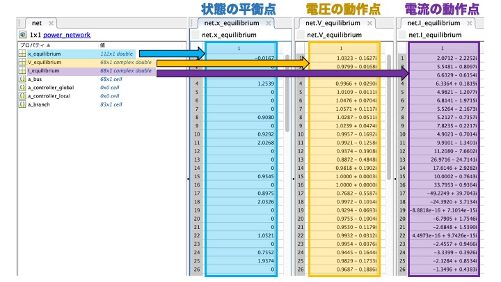
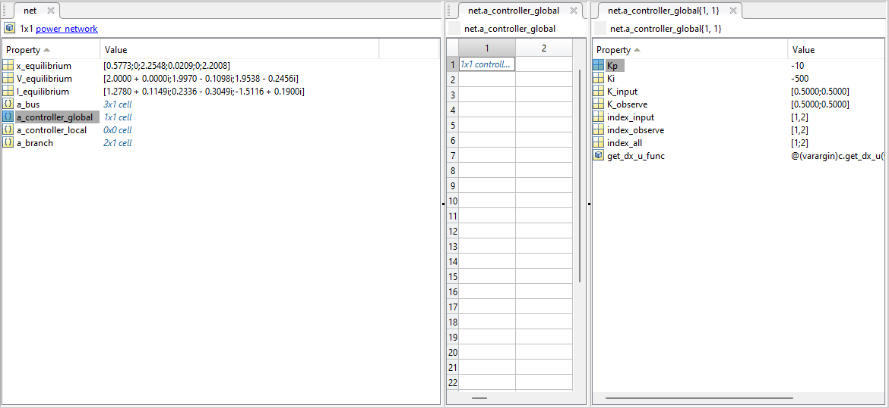

# <div style="text-align: center;"><span style="font-size: 140%; color: black; font-weight: bold">Power Network Class - Properties</span></div>

In GUILDA, the power system model is defined as a variable of the class `power_network`. The purpose of this section is to provide an imagine of what kind of power system model is implemented by looking at the values of the properties of this `power_network` class.

**Contents:**

- [Power System Model](#power_system_model)
- [Power Network Class - Properties](#power_network_class_-_properties_1)
    - [Equilibrium Properties.](#equilibrium_properties)
    - [Busbar Properties.](#busbar_properties)
    - [Branch Properties.](#branch_properties)
    - [Controller Properties.](#controller_properties)
- [Extract Network Information](#extract_network_information)
    - [Example 1 - Obtain Busbar Indexes.](#example_1_-_obtain_busbar_indexes)
    - [Example 2 - Obtain Busbar Power Flow Parameters.](#example_2_-_obtain_busbar_power_flow_parameters)
    - [Example 3 - Obtain Busbar Components.](#example_3_-_obtain_busbar_components)
    - [Example 4 - Obtain Network's Graph.](#example_4_-_obtain_networks_graph)

---

## <div style="text-align: center;"><span style="font-size: 120%; color: black; font-weight: bold">Power System Model</span></div>

For this example, the IEEE 68-bus 16-Machine Power System Model is used. This power model is already predefined in GUILDA, to create an instance of it, use the following command.

``` matlab
net = network_IEEE68bus;
```

<div style="text-align: center;">
<span style="font-size: 150%; color: black;">IEEE 68-bus Model</span><br>
<a href="../../Figures/IEEE68bus.png" target="_blank"></a>
</div>

---

## <div style="text-align: center;"><span style="font-size: 120%; color: black; font-weight: bold">Power Network Class - Properties</span></div>

This section explains all the variables (properties) included in the IEEE 68-bus power system model just defined in the `net` variable. To access that information, double-click in `net` in the workspace, which should show the following variables (properties)

- `x_equilibrium`
- `V_equilibrium`
- `I_equilibrium`
- `a_bus`
- `a_controller_global`
- `a_controller_local`
- `a_branch`

### <div style="text-align: left;"><span style="font-size: 100%; color: black; font-weight: bold">Equilibrium Properties</span></div>

- `x_equilibrium`: Equilibrium points of the state variables of the components (i.e., generators). In the case of this IEEE 68-bus model, there are 16 generators and 35 loads. Remember that each generator is defined by 7 internal states, while the load model has 0 states. Therefore, the number of states of this power system is $\small (16 \times 7) + (35 \times 0) = 112$". Thus, the number of elements of its equilibrium point (`x_equilibrium`) is also 112 x 1. The order of the elements corresponds to the order of the busbar they correspond, starting with the state variables of the busbar 1.

*Note: For details on the state variables for each component, please refer to the dedicated site [New Components](../Reference/defineNet/NewComponent.md).*

- `V_equilibrium`: Stores the voltage of the equilibrium point of each busbar in a complex array of "busbars" x 1. For this model with 68 busbars, a 68 x 1 array is obtained.

- `I_equilibrium`: Stores the current of the equilibrium point of each busbar in a complex array of "busbars" x 1. For this model with 68 busbars, a 68 x 1 array is obtained.



### <div style="text-align: left;"><span style="font-size: 100%; color: black; font-weight: bold">Busbar Properties</span></div>

**`a_bus`** 

In GUILDA, the class `bus` is the one that stores the busbar information. Each busbar is defined as a variable of this class. 

On the other hand, the property `a_bus` contains the instances of the `bus` class as a properties in a cell array. Therefore, when the IEEE 68-bus model is defined, the `a_bus` property is a 68 x 1 cell array since there are 68 bus lines that make up the system.  

There are 6 variables in each bus cell array.

- `Vabs`: Voltage Magnitude $\small (\lvert V \rvert)$. $\star$

- `Vangle`: Voltage Phase Angle $\small (\angle V)$. $\star$

- `P`: Active Power $\small (P)$. $\star$

- `Q`: Reactive Power $\small (Q)$. $\star$

- `component`: Defines what component (i.e., generator or load) is attached to each busbar. In this model, the busbar 1 to 16 have a generator attached (i.e., `generator_1axis`). All classes that define devices in GUILDA, including `generator_1axis`, have are child classes of the "super class" called `component`.

- `V_equlibrium`: Array containing the Equilibrium Voltage $\small (V)$ ([real part; imaginary part]).

- `I_equilibrium`: Array containing the Equilibrium Current $\small (V)$ ([real part; imaginary part]).

- `shunt`: The shunt resistor admittance $\small (Y_{shunt})$ ([real part; imaginary part]) value between the bus and ground. If the busbar is not connected to Ground, then the admittance value is $0$.

$\star$ Two of these properties are assigned to each busbar when it is defined, depending on the busbar type (i.e., PV bus, PQ bus, Slack bus).

In the following image can be seen that the `a_bus` property has 1 cell array per bus (i.e., 68 cell arrays in total). Each cell array contains the information that defines the bus, depending on the type of bus.


### <div style="text-align: left;"><span style="font-size: 100%; color: black; font-weight: bold">Branch Properties</span></div>


**`a_branch`** 

Similarly to the case of the `a_bus` property. In GUILDA, the class `branch` is the one that stores the branch information. Each branch is defined as a variable of this class. 

The property `a_branch` contains the instances of the `branch` class as a properties in a cell array. Therefore, when the IEEE 68-bus model is defined, the `a_branch` property is a 83 x 1 cell array since there are 83 branches (i.e., transmission lines) that make up the system.

There are 6 variables in each branch cell array.

- `from`: Busbar number that the branch (i.e., transmission lines) connect from.

- `to`:Busbar number that the branch (i.e., transmission lines) connect to.

- `x`: Real and Imaginary part of the branch's impedance (i.e., Resistance $\small (R)$ and Reactance $\small (X)$). The reciprocal of these values are Conductance $\small (G)$ and Susceptance $\small (B)$, respectively.

- `y`: Ground Capacitance of the branch.

- `tap`: Phase Adjustment of Transformer Parameters.

- `phase`: Phase Adjustment of Transformer Parameters.

In the following image can be seen that the `a_branch` property has 1 cell array per branch (i.e., 83 cell arrays in total). Each cell array contains the information that defines the branch, depending on the branch type (i.e., Transformer Branch or Transmission Branch).


### <div style="text-align: left;"><span style="font-size: 100%; color: black; font-weight: bold">Controller Properties</span></div>

**`a_controller_local` & `a_controller_global`** 

Similarly to the case of the `a_bus` and `a_branch` properties. 

In GUILDA, the class `controller_broadcast_PI_AGC_normal` defines the Global controller Automatic Generation Control (AGC). Meanwhile, local controllers, like the Retrofit control, can be implement as a new class, however they must be firstly defined as such.

**In a 3-bus model:** Taking as example the `a_controller_global` generated from the AGC Controller (`controller_broadcast_PI_AGC_normal`), which is added to busbar 1 and 2 (i.e., the ones with generators) as observation and input targers. Then, there is only 1 cell array, since it's global, an its variables are

- `Kp`: Proportional gain of the controller.
- `Ki`: Integrative gain of the controller.
- `K_input`: ASK
- `K_observe`: ASK
- `index_input`: Busbar number to which the output signal of the controller (i.e., the input signal to the system) is applied.
- `index_observe`: Busbar number observed by the controller.
- `index_all`: Busbar number that are observed and to which input is applied to.
- `get_dx_u_func`: Function to obtain the controller state derivative.

*Note: For more examples on the controller class, plese refer to the dedicated site [Controllers](/Reference/addController/0TopPage/).*

In the following image can be seen that the `a_controller_global` property has 1 cell array. It contains the information that defines the global controller.



---

## <div style="text-align: center;"><span style="font-size: 120%; color: black; font-weight: bold">Extract Network Information</span></div>

The following are a series of examples on how to extract values from the properties of the `power_network` class and process them well to organize the information of the power system model.

### <div style="text-align: left;"><span style="font-size: 100%; color: black; font-weight: bold">Example 1 - Obtain Busbar Indexes</span></div>

To obtain the indexes of the busbars according to its type (i.e., PV bus, PQ bus, Slack bus).

```matlab
bus_num = numel(net.a_bus);
bus_idx = zeros(1,bus_num);
for idx = 1:bus_num
    switch class(net.a_bus{idx})
        case 'bus_PV'
            bus_idx(idx) = 1;
        case 'bus_PQ'
            bus_idx(idx) = 2;
        case 'bus_slack'
            bus_idx(idx) = 3;
    end
end
PV_bus_idx = find(bus_idx==1)
PQ_bus_idx = find(bus_idx==2)
slack_bus_idx = find(bus_idx==3)
```
### <div style="text-align: left;"><span style="font-size: 100%; color: black; font-weight: bold">Example 2 - Obtain Busbar Power Flow Parameters</span></div>

To obtain the power flow parameters (i.e., active power, reactive power, voltage magnitude, voltage phase angle) of each busbar.

``` matlab
bus_num = numel(net.a_bus);
bus_idx = cell(bus_num,1);
Vabs  = nan(bus_num,1);
Vangle= nan(bus_num,1);
P     = nan(bus_num,1);
Q     = nan(bus_num,1);
for idx = 1:bus_num
    switch class(net.a_bus{idx})
        case 'bus_PV'
            P(idx)     = net.a_bus{idx}.P;
            Vabs(idx)  = net.a_bus{idx}.Vabs;
        case 'bus_PQ'
            P(idx)     = net.a_bus{idx}.P;
            Q(idx)     = net.a_bus{idx}.Q;
        case 'bus_slack'
            Vabs(idx)  = net.a_bus{idx}.Vabs;
            Vangle(idx)= net.a_bus{idx}.Vangle;
    end
end
idx = (1:bus_num)';
powerflow_set = table(idx,Vabs,Vangle,P,Q)
```
### <div style="text-align: left;"><span style="font-size: 100%; color: black; font-weight: bold">Example 3 - Obtain Busbar Components</span></div>

To obtain the type of component (i.e., generator or load) that is connected to each busbar.

```matlab
bus_num = numel(net.a_bus);
component_list = arrayfun(@(idx) {['bus',num2str(idx)] , class(net.a_bus{idx}.component)},(1:bus_num)','UniformOutput',false);
cell2table(vertcat(component_list{:}) ,"VariableNames",["idx" "component"])
```

### <div style="text-align: left;"><span style="font-size: 100%; color: black; font-weight: bold">Example 4 - Obtain Network's Graph</span></div>

To obtain a visual graph of the structure of the power system model.

```matlab
branch_num = numel(net.a_branch);
bus_num    = numel(net.a_bus);
adjacency_matrix = zeros(bus_num,bus_num);
for idx = 1:branch_num
    from = net.a_branch{idx}.from;
    to   = net.a_branch{idx}.to;
    adjacency_matrix(from,to)=1;
    adjacency_matrix(to,from)=1;
end
plot(graph(adjacency_matrix))
```
