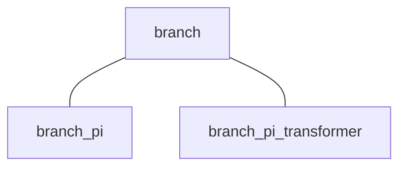

# 
Branch Class

This page explains the variables and functions used in the branch class (`branch`).

**Contents:**

- [Branch Class](#branch_class_1)
- [Branch Pi-Type Circuit Model Class](#branch_pi_type_circuit_model_class)
- [Branch Pi-Type Circuit with Transformer Model Class](#branch_pi_type_circuit_with_transformer_model_class)

---

## 
Branch Class

The branch class is one of the "super classes" in GUILDA. There are two main child classes that are derived from the branch class: 1. Branch Pi-Type Circuit Model Class (`branch_pi`), and 2. Branch Pi-Type Circuit with Transformer Model Class (`branch_pi_transformer`).

The branch super class is composed of

**Variables**

- `from`: Busbar number that the branch (i.e., transmission lines) connect from.
- `to`: Busbar number that the branch (i.e., transmission lines) connect to.

**Abstract Methods**

- `y = get_admittance_matrix(obj)`: Function to generate the network's admittance matrix.

---

## 
Branch Pi-Type Circuit Model Class

This child class implements the π-type circuit model of a transmission line with ground-to-ground capacitance.

**Variables**

- `x`: Real and Imaginary part of the branch's impedance (i.e., Resistance $\small (R)$ and Reactance $\small (X)$). The reciprocal of these values are Conductance $\small (G)$ and Susceptance $\small (B)$, respectively.

- `y`: Ground Capacitance of the branch.

**Constructor Method**

- `obj = branch_pi(from, to, x, y)`: The arguments are the variables explained above.

---

## 
Branch Pi-Type Circuit with Transformer Model Class

This child class implements the π-type circuit model of a transmission line with ground capacitance and a phase adjusting transformer built in.

**Variables**

- `x`: Real and Imaginary part of the branch's impedance (i.e., Resistance $\small (R)$ and Reactance $\small (X)$). The reciprocal of these values are Conductance $\small (G)$ and Susceptance $\small (B)$, respectively.

- `y`: Ground Capacitance of the branch.

- `tap`：Transformer's gain.

- `phase`：Transformer's phase difference.

**Constructor Method**

- `obj = branch_pi_transformer(from, to, x, y, tap, phase)`: The arguments are the variables explained above.
