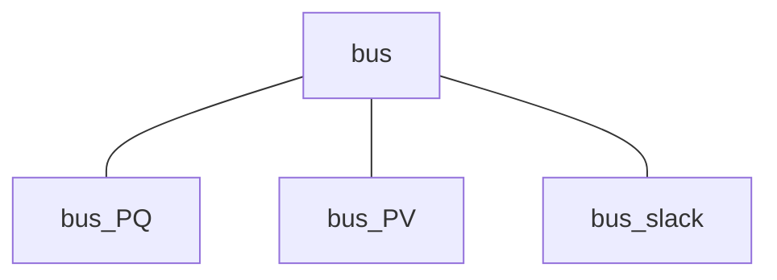

# 
Bus Class

This page explains the variables and functions used in the bus class (`bus`).

**Contents:**

- [Bus Class](#bus_class_1)
- [Slack Bus](#slack_bus)
- [PV Bus](#pv_bus)
- [PQ Bus](#pq_bus)

---

## 
Bus Class

The bus class is one of the "super classes" in GUILDA. There are three main child classes that are derived from the bus class: 1. Slack Bus (`bus_slack`), 2. PV Bus (`bus_PV`), 3. PQ Bus (`bus_PQ`).

The bus super class is composed of

**Variables**

- `component`: Defines what component (i.e., generator or load) is attached to each busbar. In this model, the busbar 1 to 16 have a generator attached (i.e., `generator_1axis`). All classes that define devices in GUILDA, including `generator_1axis`, have are child classes of the "super class" called `component`.

- `V_equilibrium`: Array containing the Equilibrium Voltage $\small (V)$ ([real part; imaginary part]).

- `I_equilibrium`: Array containing the Equilibrium Current $\small (I)$ ([real part; imaginary part]).

- `shunt`: The shunt resistor admittance $\small (Y_{shunt})$ ([real part; imaginary part]) value between the bus and ground. If the busbar is not connected to Ground, then the admittance value is $0$.

**Constructor Method**

- `set_component(obj, component)`: Instances of the `component` class, for example generators, loads, or controllers.

---

## 
Slack Bus

Most of the Buses with Generators are classified as PV buses. However, one of those buses is classified as a Slack Bus. The main difference is that it is specified by the voltage magnitude $\small (\lvert V \rvert)$ and the voltage phase angle $\small (\angle V)$. This is necessary because the voltage phase difference between the busbars can generally be obtained, but the voltage phase of each busbar is not uniquely determined. Therefore, specifying the voltage phase angle of one busbar allows to uniquely determine the voltage phase angle of the rest of busbars. Additionally, if multiple slack buses are defined, it may happen that no solution satisfies all the specified parameters. This is why there is only one slack bus for all matrices.

**Variables**

- `Vabs`: Voltage Magnitude $\small (\lvert V \rvert)$.

- `Vangle`: Voltage Phase Angle $\small (\angle V)$.

- `shunt`: The shunt resistor admittance $\small (Y_{shunt})$ ([real part; imaginary part]) value between the bus and ground. If the busbar is not connected to Ground, then the admittance value is $0$.

**Constructor Method**

- `obj = bus_slack(Vabs, Vangle, shunt)`: The arguments are the variables explained above.

---

## 
PV Bus

Generator buses are generally classified as PV buses, since they are defined by the active power $\small (P)$ and the voltage magnitude $\small (\lvert V \rvert)$.

**Variables**

- `P`: Active Power $\small (P)$.

- `Vabs`: Voltage Magnitude $\small (\lvert V \rvert)$.

- `shunt`: The shunt resistor admittance $\small (Y_{shunt})$ ([real part; imaginary part]) value between the bus and ground. If the busbar is not connected to Ground, then the admittance value is $0$.

**Constructor Method**

- `obj =bus_PV(P, V, shunt)`: The arguments are the variables explained above.

---

## 
PQ Bus

Load buses and Non-unit buses (i.e., buses with no load) are classified as PQ buses, since they are defined by the active power $\small (P)$ and reactive power $\small (Q)$.

Regarding Non-unit buses: These are busbars with no load added. They serve as interconnection points between transmission lines. However, they are also classified as PQ buses, since they can be regarded as load busbars with an infinite load.

**Variables**

- `P`: Active Power $\small (P)$.

- `Q`: Reactive Power $\small (Q)$.

- `shunt`: The shunt resistor admittance $\small (Y_{shunt})$ ([real part; imaginary part]) value between the bus and ground. If the busbar is not connected to Ground, then the admittance value is $0$.

**Constructor Method**

- `obj =bus_PQ(P, V, shunt)`: The arguments are the variables explained above.