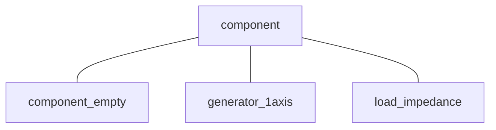

# 
Component Class

This page explains the variables and functions used in the component class (`component`).

**Contents:**

- [Component Class](#component_class_1)
- [Empty Component](#empty_component)
- [Generator](#generator)
- [Load](#load)

---

## 
Component Class

The component class is one of the "super classes" in GUILDA. As the name implies, a component is a piece of equipment, such as generators or loads. There are three main child classes that are derived from the component class: 1. Empty Component (`component_empty`), 2. Generator (`generator_1axis`), 3. Load (`load_impedance`).

The component super class is composed of

### 
Abstract Methods

**Set Equilibrium (`set_equilibrium(obj,Veq,Ieq)`)**

This method performs the initialization processing, determines the equilibrium points via power flow calculation (equilibrium voltage $\small (V_{eq})$ and equilibrium current $\small (I_{eq})$), and derives the equilibrium state.

Structure: `x = set_equilibrium(obj,Veq,Ieq)`

Input Arguments
  
  - `Veq`: Equilibrium point of the voltage (complex number) $-$ *obtained from the power flow calculation.*
  
  - `Ieq`: Equilibrium point of the current (complex number) $-$ *obtained from the power flow calculation.*

Output Parameters
  
  - `x`：Equilibrium state corresponding to the specified equilibrium point.

**Input State Order (`get_nu(obj)`)**

This method is used to determine the order of the input state (`u`).

Class Structure `nu = get_nu(obj)`

Input Arguments

  - *None*

Output Parameters

  - `nu`：Order of input state (`u`).

**State Derivative (`get_dx_constraint(obj,t, x, V, I, u)`)**

This method is used to obtain the derivative of the state $\small (x)$; when an input is applied it also provides the derivative of the current $\small (I)$.

Class Structure: `[dx,constraint] = get_dx_constraint(obj,t, x, V, I, u)`

Input Arguments

- `t`: Time $\small (t)$.
- `x`: State $\small (x)$.
- `V`: Busbar Voltage $\small (V)$ ([real part; imaginary part]).
- `I`: Busbar Current $\small (I)$ ([real part; imaginary part]).
- `u`: Input Signal $\small (u)$.

Output arguments
    
- `dx`：Derivative of the State $\small (\dot{x})$.
    
- `constraint`：The difference between the actual busbar's current $\small (I)$ and the derived one from the provided arguments "state" $\small (x)$ and "voltage" $\small (V)$. The constraint condition is that the difference between both currents $\small (I)$ should be zero.

---

## 
Empty Component

This child class implements an empty device (`component_empty`), that means that it only inherits all the characteristics of the parent class, but doesn't add anything.

---

## 
Generator

This child class implementats a generator model. In GUILDA a 1-Axis Synchronous Generator Model is used (`generator_1axis`).

### 
Variables

**Generator Parameters (`x`)**

- `Xd`: Synchronous Reactance around the d-axis $\small (X_d)$.

- `Xq`: Synchronous Reactance around the q-axis $\small (X_q)$.

- `Xd_prime`: Transient Reactance around the d-axis $\small (X'_d)$.

- `T`：Time constant of the field current around the d-axis $\small (\tau)$.

- `M`：Inertia Coefficient $\small (M)$.

- `D`：Damping Factor $\small (D)$.

**Equilibrium State (`x_equilibrium`)**

Equilibrium point of the internal state of the generator

- `delta`：Rotor declination angle $\small (\delta)$.

- `omega`：Angular frequency deviation $\small (\Delta \omega)$.

- `E`：Internal voltage $\small (E)$.

- `x_avr`：Automatic Voltage Regulator (AVR) State.

- `x_gov`：Governor State.

- `x_pss`：Power System Stabilizer (PSS) State.

**Equilibrium Voltage (`V_equilibrium`)**

Array containing the Equilibrium Voltage $\small (V)$ ([real part; imaginary part]).

**Equilibrium Current (`I_equilibrium`)**

Array containing the Equilibrium Current $\small (I)$ ([real part; imaginary part]).

**Automatic Voltage Regulator (AVR) Controller (`set_avr`)**

- `Ka`：AVR Gain.

- `Te`：Exciter Time Constant.

**Governor**

- `governor`：Instance of the governor class.

**Power System Stabilizer (`set_pss`)**

- `Kpss`: PSS Gain.

- `Tpss`: Washout Filter Time Constant.

- `TL1p, TL1`: Phase Advance-Delay Time Constant of the First Stage.

- `TL2p, TL2`: Phase Advance-Delay Time Constant of the Second Stage.

- `omega0`：Reference Angular Frequency (Grid's frequency $\small (\omega_0)$).

### 
Methods

**`obj = generator_1axis(omega, parameter)`**

- `omega`：Reference Angular Frequency (Grid's frequency $\small (\omega_0)$).

- `parameter`：Generator parameters (see above). 

---

## 
Load

This child class implements a constant impedance load model (`load_impedance`).

### 
Methods

**`obj = load_impedance(varargin)`**

Impedance values are determined from equilibrium voltage and equilibrium current; thus, no arguments are required.