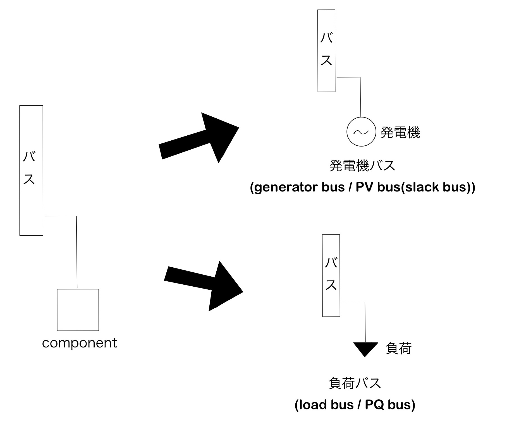

# 
Power System Model (Simple)

This page provides a brief description of the Power System Model configuration and its components.

**Contents:**

- [Electric Power Systems](#electric_power_systems)
- [Busbar](#busbar)
- [Branch](#branch)
- [Components](#components)
- [Types of Components](#types_of_components)
- [Obtaining a Power System Model](#obtaining_a_power_system_model)

---

## 
Electric Power Systems

Before we start to simulate, we would like to introduce the configuration of the power system models handled by this simulator. We will use the IEEE 68-bus model already implemented in GUILDA as an example.

IEEE 68-bus Model

 

This model is composed of

- 68 busbars (Bus in figure).
- 16 generators (Gen in the figure).
- 35 loads (▼ in the figure).
- And branches connecting each busbar (lines connecting busbars).

The components are brifly explained one-by-one in the following segments.

---

## 
Busbar

The busbar is the interconnection point (like a relay) between generators, loads, and the power grid.

The power flow calculation, which determines the supply-demand balance of electricity, considers the Active Power $\small (P)$ and Reactive Power $\small (Q)$ sent from and to the busbars, as well as the Voltage Magnitude $\small (|V|)$, and Phase Angle $\small (\angle V)$ at each bus bar to derive the parameters to achieve the desired supply-demand balance.

---

## 
Branch

It is a power transmission line between busbars. It corresponds to electric wires in the real world.

---

## 
Components

As the name implies, a component is a piece of equipment, such as generators or loads. In GUILDA, these devices are defined in a class called `component`, thus the term "component" is used here. If you refer to the code, you will see that the load and generator classes are defined as child classes of the component class.

---

## 
Types of Components

- **Generator (PV bus):** Generator buses are generally classified as PV buses, since they are defined by the active power $\small (P)$ and the voltage magnitude $\small (V)$.

- **Generator (Slack bus):** It is a special type of bus, as only one of the generators in the model is specified as a "slack bus". The main difference is that it is specified by the voltage magnitude $\small (\lvert V \rvert)$ and the voltage phase angle $\small (\angle V)$. This is necessary because the voltage phase difference between the busbars can generally be obtained, but the voltage phase of each busbar is not uniquely determined. Therefore, specifying the voltage phase angle of one busbar allows to uniquely determine the voltage phase angle of the rest of busbars. Additionally, if multiple slack buses are defined, it may happen that no solution satisfies all the specified parameters. This is why there is only one slack bus for all matrices.

- **Load (PQ bus):** Load buses are classified as PQ buses, since they are defined by the active power $\small (P)$ and reactive power $\small (Q)$.

- **Non-unit busbar (PQ bus):** These are busbars with no load added. They serve as interconnection points between transmission lines. However, they are also classified as PQ buses, since they can be regarded as load busbars with an infinite load.

Remember that the power flow calculation considers four parameters per busbar: Active Power $\small (P)$, Reactive Power $\small (Q)$, Voltage Magnitude $\small (\lvert V \rvert)$, and Phase Angle $\small (\angle V)$. Thus, a total of $4 n$ parameters for a power network consisting of $n$ busbars. Naturally, if some of these parameters are not specified, the others will not be uniquely determined. Therefore, we specify some of the 4 parameters for each bus bar, according to its type (i.e., PV bus, Slack bus, PQ bus).

---

## 
Obtaining a Power System Model

When modeling a power system, two main types of systems are considered:

1. Algebraic Equation Model defined by the transmission lines.

2. Differential Algebraic Equation Model that is formed between each busbar and the component.

The entire power system model works as a single system with changing dynamics, since the components connected to each busbar also have dynamic characteristics that affect each other as they are interconnected by the algebraic equations of the network.

   
