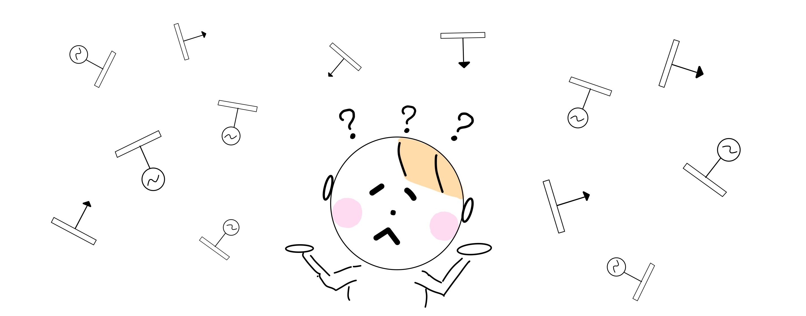

# 
GUILDA Documentation

This is the official documentation of GUILDA.

**Contents:**

- [Description.](#description)
- [Mathematical Model of GUILDA.](#mathematical_model_of_guilda)
- [GUILDA Setup.](#guilda_setup)
- [Power System Model (simple).](#power_system_model_simple)
- [Guided Example.](#guided_example)
- [GUILDA in Detail.](#guilda_in_detail)
- [Source Code Explanation.](#source_code_explanation)
- [Operation using User Interface (UI).](#operation_using_user_interface_ui)

---

## 
Description

[GUILDA](https://github.com/guilda-dev/guilda) stands for Grid & Utility Infrastructure Linkage Dynamics Analyzer.
It is a numerical simulation platform for smart energy management.

The purpose of this program is to provide students and researchers in the field of systems and control engineering with an advanced numerical simulation environment that can be used with minimal knowledge of power systems. To achieve this, it is recommended to use this program in closeness with the textbook ["Power Systems Control Engineering: Systems Theory and MATLAB Simulation"](https://www.coronasha.co.jp/np/isbn/9784339033847/) (only available in its original language, Japanese. The English translation is currently being developed). In this textbook the authors explain the structure and mathematical fundamentals of power systems in the language of systems and control engineering.

We are devising a way for students to learn the mathematical fundamentals and the construction of a numerical simulation environment in parallel. Through these activities, we aim to establish power systems as one of the familiar benchmark models in the field of systems and control, thereby helping to promote power system reform through the technologies and knowledge in this field.

This is an in-development project by the [Ishizaki Laboratory](https://www.ishizaki-lab.jp/home) at [Tokyo Institute of Technology](https://www.titech.ac.jp/english#) and [Assistant Professor Kawaguchi](http://hashi-lab.ei.st.gunma-u.ac.jp/~hashimotos/member/kawaguchi/en/index.html) of Gunma University.

To learn more visit [here](https://www.ishizaki-lab.jp/guilda).

---

## 
Mathematical Model of GUILDA

The mathematical models used in GUILDA are in line with the contents of the textbook ["Power Systems Control Engineering: Systems Theory and MATLAB Simulation"](https://www.coronasha.co.jp/np/isbn/9784339033847/). The detailed mathematical models and formulas for the state-space model are also introduced in different sections of this documentation, but if you want a systematic understanding, please refer to the textbook.

---

## 
GUILDA Setup

This section explains how to download the public source code and set up the environment (Click on the illustration ↓).
[

](SetEnvironment/0TopPage.md)

---

## 
Power System Model (Simple)

The following is a brief description of the power system model configuration (Click on the illustration ↓).
[

](aboutPowerSystem/0TopPage.md)

---

## 

Guided Example

This section provides a guided example in which the most important functionalities of GUILDA are shown: Define a Power System, Simulate the System's Response, Add a Controller, Simulate the System's Response with a Controller. If you are new to GUILDA, please refer to this page to get an idea of the overall flow of the simulator.

The three busbar system introduced in the text is used as the analysis target, and the model is implemented on this simulator to actually run the simulation and see the response (Click on the illustration ↓).
[

](SeriesAnalysis/0TopPage.md)

---

## 

GUILDA in Detail

This section explains each step in the process of implementing a model and performing an analysis. Specifically, it explains: how to use the methods for performing the analysis, how to define a new component, how to define a new controller (Click on the Illustration ↓).  
[

](Reference/0TopPage.md)

---

## 
Source Code Explanation

This section explains the functions, properties, methods, classes, etc. useed in the source code of GUILDA (Click on the Illustration ↓).

[

](SourceCode/0TopPage.md)

---

## 
Operation Using User Interface (UI)

Not available - Under Development.

This section explains how to use GUILDA with the User Interface (UI) (Click on the Illustration ↓).

